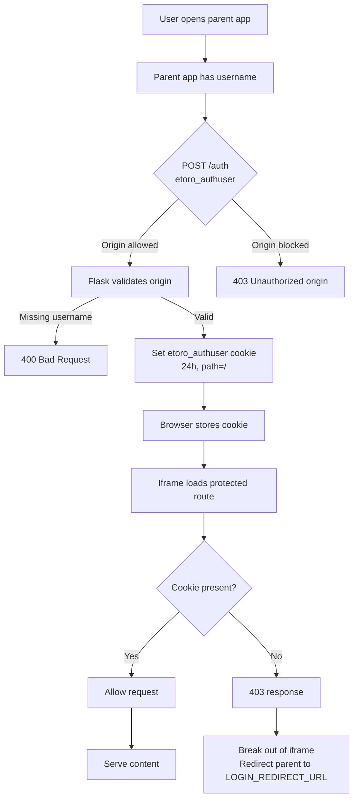

# Authentication

This document describes how the parent app authenticates with the Flask iframe app, and how to implement it.

## Overview

The Flask app is embedded as an iframe inside the parent app (`app.alphasentra.com`). Every route in the Flask app requires authentication. The parent app authenticates once by POSTing the `etoro_authuser` to `/auth`, which sets a 24-hour cookie. Subsequent iframe requests automatically include that cookie.

There is no login form inside the iframe. Unauthenticated requests receive `403 Unauthorized`.

## Architecture

```
Parent app (app.alphasentra.com)
    │
    │ 1. POST /auth with etoro_authuser
    │    Origin: https://app.alphasentra.com
    │
    ▼
Flask app (func.alphasentra.com)
    │
    │ 2. Validates origin → sets etoro_authuser cookie (24h)
    │
    ▼
Browser stores cookie for func.alphasentra.com
    │
    │ 3. Iframe loads any route → cookie sent automatically
    │
    ▼
Flask app validates cookie → serves content
```



## Security

- `/auth` accepts requests only from origins matching `PARENT_APP_ALLOWED_ORIGINS` or `*.alphasentra.com`
- Cookie policy is chosen automatically per request:
  - Same-origin → `SameSite=Lax`
  - Cross-origin → `SameSite=None; Secure`
- Cookie path is `/` so it is sent on every route
- Cookie TTL is 24 hours
- No query-string auth fallback — cookie is required
- 403 responses redirect to `LOGIN_REDIRECT_URL` configured in `Functions/port/config.py`

## Configuration

All auth-related settings are in `Functions/port/config.py`:

```python
PARENT_APP_DOMAIN = "alphasentra.com"
PARENT_APP_ALLOWED_ORIGINS = [
    "https://app.alphasentra.com",
    "http://localhost:8888",
    "http://127.0.0.1:8888",
]
LOGIN_REDIRECT_URL = "https://app.alphasentra.com/login"
```

To allow additional origins, add them to `PARENT_APP_ALLOWED_ORIGINS`. Any subdomain of `alphasentra.com` is also accepted.

## Parent App Implementation

### React with TypeScript

```tsx
type FlaskIframeProps = {
  username: string;
  flaskBaseUrl?: string;
  route?: string;
};

type AuthState = 'idle' | 'authenticating' | 'ready' | 'error';

const FlaskIframe: React.FC<FlaskIframeProps> = ({
  username,
  flaskBaseUrl = 'https://func.alphasentra.com',
  route = '/etopi',
}) => {
  const [authState, setAuthState] = React.useState<AuthState>('idle');
  const [error, setError] = React.useState<string | null>(null);
  const iframeRef = React.useRef<HTMLIFrameElement>(null);

  React.useEffect(() => {
    let cancelled = false;

    async function authenticate() {
      try {
        setAuthState('authenticating');
        setError(null);

        const response = await fetch(`${flaskBaseUrl}/auth`, {
          method: 'POST',
          headers: {
            'Content-Type': 'application/x-www-form-urlencoded',
          },
          body: `etoro_authuser=${encodeURIComponent(username)}`,
          credentials: 'include',
        });

        if (!response.ok) {
          const body = await response.json().catch(() => ({}));
          throw new Error(body?.error || `Auth failed with ${response.status}`);
        }

        if (!cancelled) {
          setAuthState('ready');
        }
      } catch (err) {
        if (!cancelled) {
          setError(err instanceof Error ? err.message : 'Authentication failed');
          setAuthState('error');
        }
      }
    }

    authenticate();

    return () => {
      cancelled = true;
    };
  }, [username, flaskBaseUrl]);

  const iframeSrc = authState === 'ready' ? `${flaskBaseUrl}${route}` : undefined;

  if (authState === 'error') {
    return (
      <div className="flask-iframe-error">
        <p>Authentication failed</p>
        <p>{error}</p>
      </div>
    );
  }

  if (authState === 'authenticating' || !iframeSrc) {
    return <div className="flask-iframe-loading">Loading portfolio...</div>;
  }

  return (
    <iframe
      ref={iframeRef}
      src={iframeSrc}
      title="Portfolio Analytics"
      style={{ width: '100%', height: '100vh', border: 'none' }}
      allow="fullscreen"
    />
  );
};

export default FlaskIframe;
```

### React with TypeScript + custom hook

```tsx
type UseFlaskAuthOptions = {
  flaskBaseUrl?: string;
  username: string;
};

type UseFlaskAuthResult = {
  authState: 'idle' | 'authenticating' | 'ready' | 'error';
  error: string | null;
  iframeSrc: string | null;
};

const useFlaskAuth = ({
  flaskBaseUrl = 'https://func.alphasentra.com',
  username,
}: UseFlaskAuthOptions): UseFlaskAuthResult => {
  const [authState, setAuthState] = React.useState<'idle' | 'authenticating' | 'ready' | 'error'>('idle');
  const [error, setError] = React.useState<string | null>(null);
  const [iframeSrc, setIframeSrc] = React.useState<string | null>(null);

  React.useEffect(() => {
    let cancelled = false;

    async function authenticate() {
      try {
        setAuthState('authenticating');
        setError(null);

        const response = await fetch(`${flaskBaseUrl}/auth`, {
          method: 'POST',
          headers: {
            'Content-Type': 'application/x-www-form-urlencoded',
          },
          body: `etoro_authuser=${encodeURIComponent(username)}`,
          credentials: 'include',
        });

        if (!response.ok) {
          const body = await response.json().catch(() => ({}));
          throw new Error(body?.error || `Auth failed with ${response.status}`);
        }

        if (!cancelled) {
          setIframeSrc(`${flaskBaseUrl}/etopi`);
          setAuthState('ready');
        }
      } catch (err) {
        if (!cancelled) {
          setError(err instanceof Error ? err.message : 'Authentication failed');
          setAuthState('error');
        }
      }
    }

    authenticate();

    return () => {
      cancelled = true;
    };
  }, [flaskBaseUrl, username]);

  return { authState, error, iframeSrc };
};
```

Usage:

```tsx
const FlaskIframeContainer: React.FC<{ username: string }> = ({ username }) => {
  const { authState, error, iframeSrc } = useFlaskAuth({
    flaskBaseUrl: 'https://func.alphasentra.com',
    username,
  });

  if (authState === 'error') {
    return <div className="error">Auth error: {error}</div>;
  }

  if (authState === 'authenticating' || !iframeSrc) {
    return <div className="loading">Loading...</div>;
  }

  return (
    <iframe
      src={iframeSrc}
      title="Portfolio Analytics"
      style={{ width: '100%', height: '100vh', border: 'none' }}
    />
  );
};
```

## Production Requirements

When deploying with HTTPS and cross-origin iframe:

1. Ensure `func.alphasentra.com` is served over **HTTPS**
2. The Flask app automatically sets `SameSite=None; Secure` on cookies for cross-origin requests
3. The parent app must POST with `credentials: 'include'`
4. Add production origins to `PARENT_APP_ALLOWED_ORIGINS` if needed

## API Reference

### POST /auth

Authenticates and sets the `etoro_authuser` cookie.

**Request**

```
POST /auth
Origin: https://app.alphasentra.com
Content-Type: application/x-www-form-urlencoded

etoro_authuser=SomeEToroUser
```

**Success response**

```
HTTP 200
Set-Cookie: etoro_authuser=SomeEToroUser; Max-Age=86400; Path=/; SameSite=None; Secure
```

```json
{
  "ok": true
}
```

**Error responses**

```
HTTP 400 - missing etoro_authuser
HTTP 403 - origin not allowed
```

### Protected routes

All routes except `/auth`, `/etopi/check_cache`, and `/test_iframe_auth.html` require the `etoro_authuser` cookie.

```
GET /etopi
Cookie: etoro_authuser=SomeEToroUser
```

If the cookie is missing or empty:

```
HTTP 403
Content-Type: text/html

<!DOCTYPE html>
<html>
<head>
    <script>
        if (window.top !== window.self) {
            window.top.location.href = "https://app.alphasentra.com/login";
        } else {
            window.location.href = "https://app.alphasentra.com/login";
        }
    </script>
</head>
<body>
    <p>Redirecting to login...</p>
</body>
</html>
```

When loaded inside an iframe, this response breaks out of the iframe and redirects the parent window to `LOGIN_REDIRECT_URL`. When accessed directly (not in an iframe), it redirects the current window.

## Troubleshooting

**Iframe redirects to login unexpectedly**
- The `etoro_authuser` cookie may have expired (24h TTL)
- The parent app needs to re-authenticate by POSTing to `/auth` again
- Check that the cookie is present in DevTools → Application → Cookies → `func.alphasentra.com`

**Iframe shows 403**
- Verify the parent app successfully POSTed to `/auth` and got `{"ok": true}`
- Check that the cookie was set (DevTools → Application → Cookies → `func.alphasentra.com`)
- Ensure the cookie path is `/`
- For cross-origin iframes, ensure the Flask app uses HTTPS

**Cookie not stored**
- Cross-origin cookies require `SameSite=None; Secure` and HTTPS
- Same-origin cookies work with `SameSite=Lax` on HTTP

**CORS errors**
- The Flask app adds CORS headers automatically for `/auth`, `/etopi/check_cache`, and `/static/*`
- Ensure the parent app sends the correct `Origin` header
