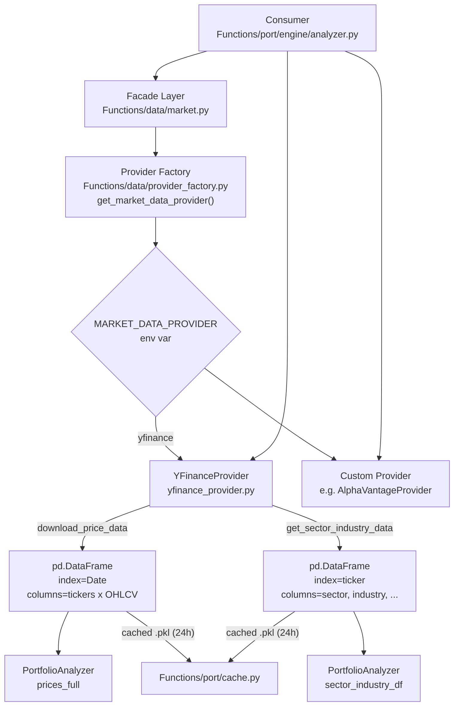
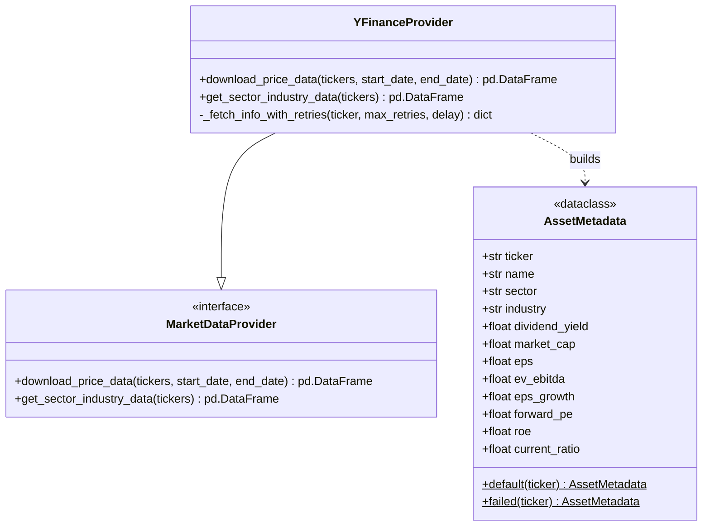

# Data Provider Architecture

Market data is abstracted behind a provider interface to support pluggable data sources. The default provider is **Yahoo Finance**, selected via the `DATA_PROVIDER` config key or the `MARKET_DATA_PROVIDER` environment variable.

## Architecture



## Components

| File | Purpose |
|------|---------|
| `protocols.py` | Abstract base class `MarketDataProvider` defining the provider interface |
| `models.py` | `AssetMetadata` dataclass for sector/industry/fundamental data returned by `get_sector_industry_data` |
| `yfinance_provider.py` | Default `YFinanceProvider` implementation using `yfinance` |
| `provider_factory.py` | Factory function `get_market_data_provider()` returning the configured provider |
| `market.py` | Facade module preserving existing function signatures while delegating to the provider |
| `loader.py` | Additional data loading utilities |

## Data Flow

1. **Initialization** — `Functions/port/main.py` calls `get_market_data_provider()` to obtain the configured `MarketDataProvider` instance and passes it to `PortfolioAnalyzer`.
2. **Price download** — `analyzer.py` calls `provider.download_price_data(tickers, start, end)`. The provider returns a `pd.DataFrame` with a `DatetimeIndex` and tickers as columns.
3. **Sector/industry fetch** — `analyzer.py` calls `provider.get_sector_industry_data(tickers)`. The provider returns a `pd.DataFrame` indexed by ticker with metadata columns.
4. **Caching** — Both calls are optionally cached by `Functions/port/cache.py` using pickle files. Price data TTL is 24 hours; sector data TTL is 24 hours.

## Class Diagram



> The factory is currently a module-level function (`get_market_data_provider()`) rather than a class. Custom providers are resolved by extending `MarketDataProvider` and adding a branch in `provider_factory.py`.

## Provider Interface

`protocols.py` defines the contract:

```python
class MarketDataProvider(ABC):
    @abstractmethod
    def download_price_data(self, tickers, start_date, end_date) -> pd.DataFrame:
        pass

    @abstractmethod
    def get_sector_industry_data(self, tickers) -> pd.DataFrame:
        pass
```

### `download_price_data`

- **Input:** `tickers: list[str]`, `start_date: str|datetime`, `end_date: str|datetime`
- **Output:** `pd.DataFrame` with a `DatetimeIndex` and tickers as columns. Must contain at least `Close` (and ideally `Adj Close`, `High`, `Low`, `Open`, `Volume`). Any missing tickers should be represented as all-NaN columns rather than being silently dropped, so downstream logic can identify failed tickers.
- **Error handling:** Raise `ValueError` if no data is returned for the requested parameters.
- **Caching:** Callers handle caching via `cache.set()` using the key shape `(sorted_tickers_tuple, start_date_str)`. Providers may cache internally for finer control.

### `get_sector_industry_data`

- **Input:** `tickers: list[str]`
- **Output:** `pd.DataFrame` indexed by ticker. Must include at minimum `sector` and `industry` string columns. Additional columns should match those exposed by `AssetMetadata`:

| Column | Type | Notes |
|--------|------|-------|
| `ticker` | `str` | Used as the index |
| `name` | `str` | Company display name |
| `sector` | `str` | GICS sector; fallback `"Others"` |
| `industry` | `str` | GICS industry; fallback `"Others"` |
| `dividendYield` | `float` | Normalized to decimal (e.g., `0.03` = 3%) |
| `marketCap` | `float \| None` | Enterprise value in reporting currency |
| `eps` | `float \| None` | Trailing earnings per share |
| `ev_ebitda` | `float \| None` | EV / EBITDA ratio |
| `eps_growth` | `float \| None` | Earnings growth rate |
| `forward_pe` | `float \| None` | Forward P/E ratio |
| `roe` | `float \| None` | Return on equity |
| `current_ratio` | `float \| None` | Current ratio |

- **Error handling:** For tickers that cannot be resolved, return `AssetMetadata.failed(ticker)` so the row is present in the DataFrame rather than raising an exception.

## Factory Selection

`provider_factory.py` selects the provider at runtime:

```python
import os
from .yfinance_provider import YFinanceProvider
from .protocols import MarketDataProvider

def get_market_data_provider() -> MarketDataProvider:
    provider_name = os.getenv("MARKET_DATA_PROVIDER", "yfinance").lower()
    if provider_name == "yfinance":
        return YFinanceProvider()
    raise ValueError(f"Unsupported market data provider: {provider_name}")
```

The `DATA_PROVIDER` constant in `config.py` documents the default but the actual runtime selection uses the `MARKET_DATA_PROVIDER` environment variable.

## Default Provider: Yahoo Finance

`YFinanceProvider` implements both interface methods:

- **`download_price_data`** — Calls `yf.download()` with `auto_adjust=False`. Results are cached via `Functions/port/cache.py` with `_PRICE_TTL` (24 hours).
- **`get_sector_industry_data`** — Fetches `yf.Ticker(ticker).info` concurrently with up to 10 workers. Retries failed tickers up to 3 times. Returns an `AssetMetadata` DataFrame cached with `_SECTOR_TTL` (24 hours).

## Facade Layer

`market.py` wraps the provider with utility functions such as `detect_relisted_stocks()`, providing a backward-compatible interface for the rest of the portfolio engine.

## Consumer Usage

`Functions/port/engine/analyzer.py` consumes the provider directly:

```python
from data.provider_factory import get_market_data_provider

provider = get_market_data_provider()
self.prices_full = provider.download_price_data(tickers, effective_start, self.end)
self.sector_industry_df = provider.get_sector_industry_data(all_tickers)
```

## Adding a New Provider

Follow these steps to add a new data provider (e.g., Alpha Vantage, Polygon.io):

### 1. Create the provider module

Create a new file under `Functions/data/`, for example `alphavantage_provider.py`. It must import `MarketDataProvider` from `.protocols` and implement both abstract methods.

```python
# Functions/data/alphavantage_provider.py
import pandas as pd
from .protocols import MarketDataProvider
from .models import AssetMetadata


class AlphaVantageProvider(MarketDataProvider):
    def download_price_data(self, tickers, start_date, end_date) -> pd.DataFrame:
        ...
        return pd.DataFrame()  # DatetimeIndex, tickers as columns

    def get_sector_industry_data(self, tickers) -> pd.DataFrame:
        ...
        return pd.DataFrame(
            columns=["name", "sector", "industry", "dividendYield",
                     "marketCap", "eps", "ev_ebitda", "eps_growth",
                     "forward_pe", "roe", "current_ratio"]
        ).set_index("ticker")  # pd.Index named "ticker"
```

### 2. Implement `download_price_data`

- Fetch OHLCV data for all tickers in the list.
- Return a single `pd.DataFrame` with a `DatetimeIndex` and ticker-derived columns.
- Raise `ValueError` if the result is empty.

### 3. Implement `get_sector_industry_data`

- Build a list of `AssetMetadata` records—one per ticker.
- Use `AssetMetadata(ticker=..., sector="Others", industry="Others", ...)` for known tickers.
- Use `AssetMetadata.failed(ticker)` when the source returns incomplete data for a ticker.
- Convert records to a DataFrame using `_to_camel_case` style column names; set the index to `ticker`.

### 4. (Optional) Add caching

If your upstream API has rate limits, cache price data using:

```python
from Functions.port.cache import get as cache_get, set as cache_set
from Functions.config import CACHE_TTL_PRICE, CACHE_TTL_SECTOR

cache_key = (tuple(sorted(tickers)), str(start_date))
cached = cache_get(cache_key, CACHE_TTL_PRICE, ext=".pkl")
if cached is not None:
    return cached
# ... fetch ...
cache_set(cache_key, data, ext=".pkl")
```

### 5. Register in the factory

Update `Functions/data/provider_factory.py`:

```python
import os
from .yfinance_provider import YFinanceProvider
from .alphavantage_provider import AlphaVantageProvider
from .protocols import MarketDataProvider


def get_market_data_provider() -> MarketDataProvider:
    provider_name = os.getenv("MARKET_DATA_PROVIDER", "yfinance").lower().strip()
    if provider_name == "yfinance":
        return YFinanceProvider()
    if provider_name == "alphavantage":
        return AlphaVantageProvider()
    raise ValueError(f"Unsupported market data provider: {provider_name}")
```

### 6. Add integration tests

Add or update `Functions/tests/` with tests that:

- Verify `download_price_data` returns the expected column structure.
- Verify `get_sector_industry_data` returns an index named (or sortable as) `ticker` and an `AssetMetadata`-derived schema.
- Handle missing or partial ticker info without raising.

### 7. Use the new provider

Set the environment variable before running:

```bash
export MARKET_DATA_PROVIDER=alphavantage
# or on Windows:
$env:MARKET_DATA_PROVIDER = "alphavantage"
```

Or pass the provider instance directly in code:

```python
from Functions.data.alphavantage_provider import AlphaVantageProvider
from Functions.port.engine.analyzer import PortfolioAnalyzer

analyzer = PortfolioAnalyzer(config, market_data_provider=AlphaVantageProvider())
```
