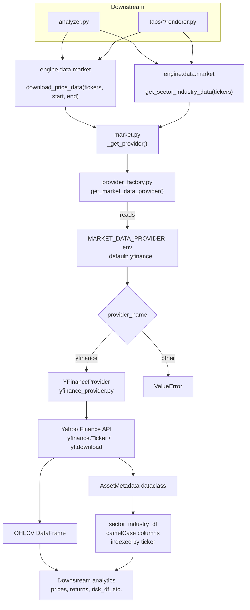

# Data Provider Layer

The portfolio functions system routes all market data access through a pluggable provider abstraction. This isolates Yahoo Finance (the default source) from the rest of the codebase so that alternative data sources can be swapped in without touching downstream consumers.

## Modules

| Module | Role |
|---|---|
| `engine/data/protocols.py` | `MarketDataProvider` ABC |
| `engine/data/models.py` | `AssetMetadata` dataclass |
| `engine/data/yfinance_provider.py` | Yahoo Finance implementation |
| `engine/data/provider_factory.py` | Provider selection by name |
| `engine/data/market.py` | Facade preserving backward-compatible imports |

## Request Flow



## Provider Selection

The factory function `get_market_data_provider()` reads the environment variable `MARKET_DATA_PROVIDER` (fallback `"yfinance"`) and returns the matching implementation. The `DATA_PROVIDER` key in `engine/config.py` is the canonical default.

## Interface Contract

Every provider must implement two methods:

```python
class MarketDataProvider(ABC):
    def download_price_data(self, tickers, start_date, end_date) -> pd.DataFrame: ...

    def get_sector_industry_data(self, tickers) -> pd.DataFrame: ...
```

### `download_price_data(...)`

Returns OHLCV price data for the requested tickers and date range.

- **Columns**: multi-level or flat, always containing at least `Close`.
- **Index**: trading dates (`datetime`).
- **Failure**: raise `ValueError` if the result is empty.

### `get_sector_industry_data(...)`

Returns one row per ticker normalised into the `AssetMetadata` schema and materialised as a `pd.DataFrame` indexed by `ticker`. Column names follow the camelCase convention used downstream (`dividendYield`, `marketCap`, `ev_ebitda`, `eps_growth`, `forward_pe`, `roe`, `current_ratio`). Missing numeric fields default to `0.0`; failed lookups fall back to `AssetMetadata.default(ticker)`.

## Yahoo Finance Implementation

`YFinanceProvider` normalises ASX tickers (`.ASX` → `.AX`) before every network call and normalises dividend yields (`None` → `0.0`; values > 1 are divided by 100) so that downstream code always receives a decimal yield.

## Facade

`engine/data/market.py` keeps the original function names (`download_price_data`, `get_sector_industry_data`, `detect_newly_available_stocks`, `detect_relisted_stocks`) and forwards the first two to the active provider. Existing imports from `engine.data.market` remain valid.

## Extending with a New Provider

1. Create `engine/data/<name>_provider.py` implementing `MarketDataProvider`.
2. Import it in `provider_factory.py` and add a branch in `get_market_data_provider()`.
3. Set `MARKET_DATA_PROVIDER=<name>` as an environment variable or update `engine/config.py`.
