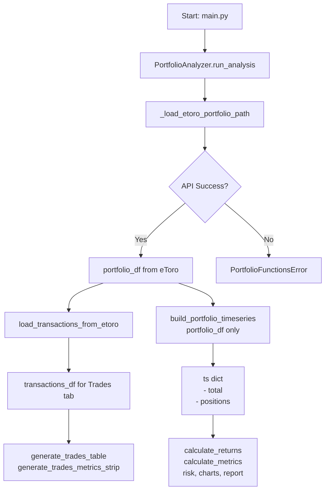
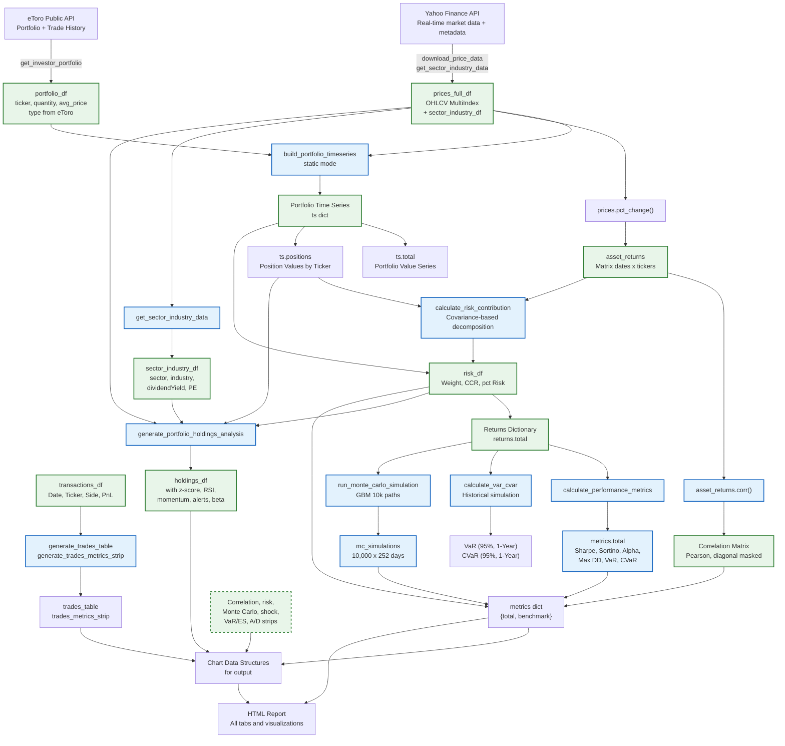
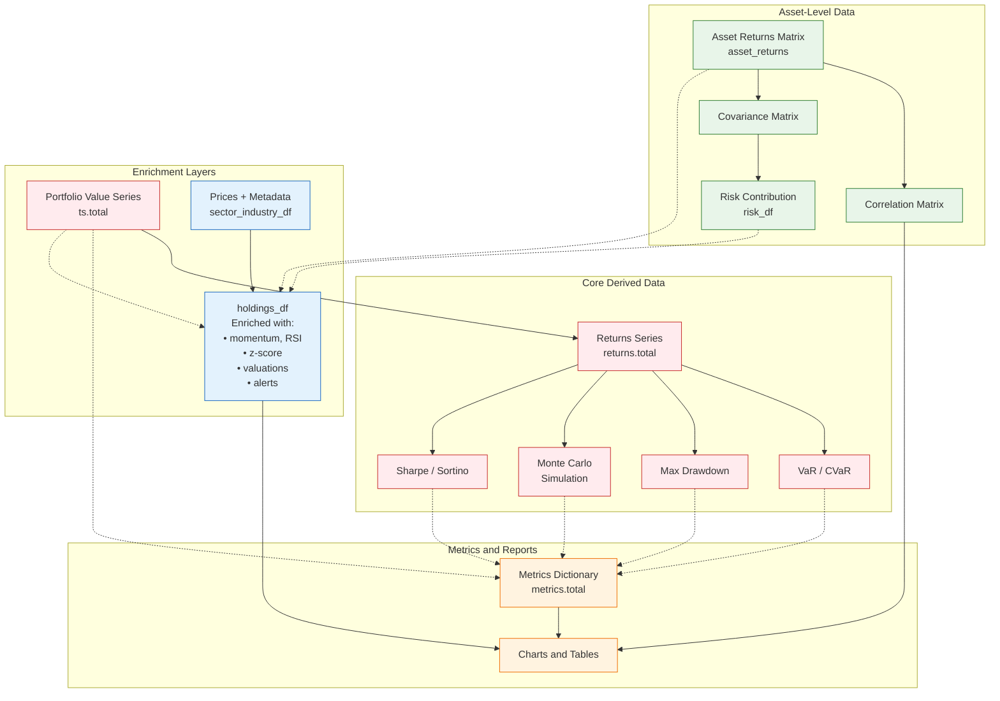
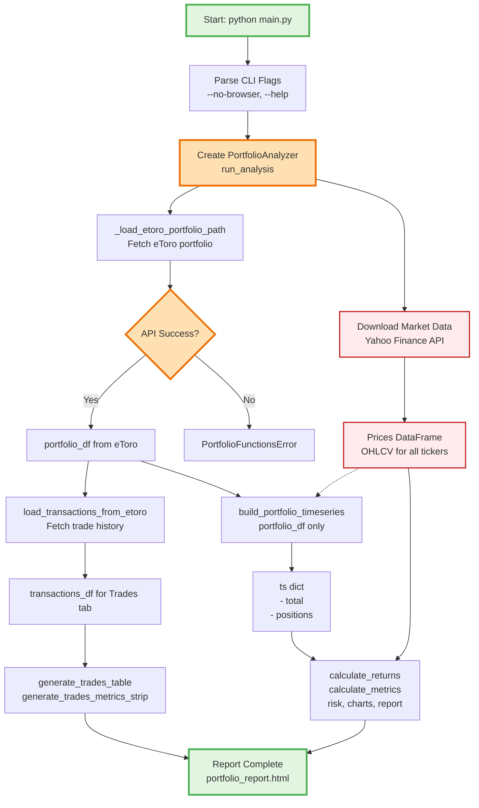

# Data Architecture: Portfolio Functions System

## Overview

The portfolio functions system uses a layered data architecture where raw inputs flow through preprocessing stages to produce the final metrics and visualizations. This document explains the complete data pipeline, starting from the **eToro API data sources** that feed the analysis.

---

## Table of Contents

1. [Core Concept](#core-concept)
2. [Input Method Selection](#input-method-selection)
3. [Input Data Sources](#input-data-sources)
4. [Derived Datasets](#derived-datasets)
5. [Data Flow Architecture](#data-flow-architecture)
6. [Dataset Usage Matrix](#dataset-usage-matrix)
7. [Detailed Dataset Descriptions](#detailed-dataset-descriptions)
8. [Complete Pipeline Flow](#complete-pipeline-flow)
9. [Holdings Status & Scoring Loop](#holdings-status--scoring-loop)

---

## Core Concept

The system converts **static holdings or transaction history** + **market data** into a **portfolio value time series**, which becomes the foundation for all risk and performance calculations.

**Key insight**: Almost all metrics (correlation, VaR, Monte Carlo, drawdowns) ultimately derive from the **daily portfolio returns series**, while decomposition metrics (risk contribution, sector breakdown) require individual asset returns as well.

---

## Input Method Selection

### eToro API (Single Path)

The system fetches portfolio and transaction data directly from the eToro public API. There is no file-based input method.

```
eToro Public API (portfolio + trade history)
           ↓
      portfolio_df (live positions)
           ↓
      transactions_df (trade history, for Trades tab only)
           ↓
      build_portfolio_timeseries(portfolio_df=...)
           ↓
      ts = {
          'total': portfolio value series,
          'positions': individual position values
      }
           ↓
      calculate_returns
           ↓
      Metrics, risk, charts, HTML report
```

**Key code**: `analyzer.py:91-150` (`_load_etoro_portfolio_path`), `analyzer.py:389-403` (`build_timeseries`), `data/loader.py:182` (`load_transactions_from_etoro`)

**Note**: `transactions_df` is loaded from the eToro trade history API and is used exclusively for the **Trades** tab (blotter and statistics). It is **not** used to construct the portfolio time series.

---

### Input Method Flow



---

## How Input Selection Affects the Pipeline

### eToro Portfolio Path

**Data flow**:

```
eToro API (get_investor_portfolio)
          ↓
     portfolio_df (ticker, quantity, avg_price, type)
          ↓
     build_portfolio_timeseries(portfolio_df=...)
          ↓
     ts = {
         'total': portfolio value series,
         'positions': individual position values
     }
          ↓
     calculate_returns
          ↓
     Metrics, risk, charts, HTML report
```

**Key code**: `analyzer.py:91-150` (`_load_etoro_portfolio_path`), `analyzer.py:389-403` (`build_timeseries`)

---

### Transaction History (Trades Tab Only)

**Data flow**:

```
eToro API (get_trade_history)
          ↓
     transactions_df (Date, Ticker, Side, EntryPrice, ExitPrice, PnL)
          ↓
     generate_trades_table
     generate_trades_metrics_strip
```

**Key code**: `data/loader.py:182` (`load_transactions_from_etoro`), `engine/modules/history/renderer.py:92`, `engine/modules/history/charts.py:27`

**Note**: `transactions_df` is loaded from the eToro trade history API and is used exclusively for the **Trades** tab. It is **not** used to construct the portfolio time series.

---

## Input Data Sources

### 1. Portfolio Holdings (eToro API)

**Source**: eToro Public API via `client.get_investor_portfolio()`

- `ticker`: Normalized ticker symbol (`.ASX` → `.AX`)
- `quantity`: Portfolio weight
- `avg_price`: Average entry price
- `type`: Trade direction (`L` / `S` / `MIXED`)

### 2. Transaction History (eToro API)

**Source**: eToro Public API via `client.get_trade_history()`

- Used exclusively for the **Trades** tab (blotter and statistics)
- Columns: `Date`, `Ticker`, `Name`, `Side`, `EntryPrice`, `ExitPrice`, `PnL`
- FIFO accounting applied in the Trades module only

### 3. Market Data (Prices)

**Source**: Yahoo Finance via `yfinance` library

**Downloaded tickers**:
- All portfolio holdings (from eToro API)
- Benchmark ticker (default: `^AXJO` – S&P/ASX 200 Index)
- Market index (`^AXJO` – ASX 200 index)

**Data retrieved**: Full OHLCV data (Open, High, Low, Close, Volume) for the entire date range

**Date range**: From portfolio inception to current date

---

## Derived Datasets

After loading raw data, the system constructs these key datasets:

### Dataset 1: `prices` (OHLCV DataFrame)

```
Type: pd.DataFrame
Index: Trading dates (datetime)
Columns: Ticker symbols (e.g., 'VAS.AX', 'BHP.AX', 'A200.AX')
Values: Closing prices (float, AUD)
Shape: [n_dates × n_tickers]
```

**Source**: `download_price_data()` → filtered to `Close` column

**Used for**: Base data for all time series construction

---

### Dataset 2: `ts` (Portfolio Time Series Dictionary)

```python
ts = {
    'total':     pd.Series,      # Total portfolio value (AUD) over time
    'positions': pd.DataFrame,   # Individual position values per ticker [dates × tickers]
}
```

**Created by**: `build_portfolio_timeseries()` in `engine/modeling/timeseries.py`

**Construction logic**:
- **Percentage allocation**: Quantity = weight × initial capital / initial price
- **Actual shares**: Quantity × price per share
- If `rebalance=True`, weights are rebalanced quarterly to maintain target allocation

---

### Dataset 3: `returns` (Returns Dictionary)

```python
returns = {
    'total':     pd.Series,  # Daily % returns for total portfolio
}
```

**Calculation**: `ts['total'].pct_change().dropna()` (or eToro gain timeseries when available)

**Example**:
```
Date        | total
2023-01-02 | +0.0123 (1.23%)
2023-01-03 | -0.0045 (-0.45%)
```

**Used for**: All risk metrics, VaR, Monte Carlo simulations, performance ratios

---

### Dataset 4: `asset_returns` (Asset Returns Matrix)

```
Type: pd.DataFrame
Index: Trading dates
Columns: Ticker symbols (active holdings only)
Values: Daily percentage returns
Shape: [n_dates × n_active_tickers]
```

**Created inline**: `prices[active_tickers].pct_change().dropna()`

**Critical for**:
- Correlation matrix
- Risk contribution analysis (covariance matrix)
- Individual beta calculations

---

### Dataset 5: `risk_df` (Risk Contribution DataFrame)

```python
risk_df = pd.DataFrame({
    'Weight':               float,  # Current portfolio weight
    'Risk Contribution':    float,  # Absolute contribution to portfolio vol
    '% Risk Contribution':  float,  # Percentage of total risk
})
# Index = ticker symbols
```

**Calculated via**: `calculate_risk_contribution()` in `engine/modeling/risk.py:87-126`

**Methodology**:

1. **Weights**: Latest position value / total portfolio value
2. **Covariance matrix**: `asset_returns.cov() * 252` (annualized)
3. **Portfolio volatility**: `σ_p = √(wᵀ × Σ × w)`
4. **Marginal Contribution to Risk (MCR)**: `MCR_i = (Σ × w)_i / σ_p`
5. **Component Contribution to Risk (CCR)**: `CCR_i = w_i × MCR_i`

---

### Dataset 6: `sector_industry_df` (Metadata DataFrame)

```python
sector_industry_df = pd.DataFrame({
    'ticker':           str,     # Ticker symbol (index key)
    'name':             str,     # Company name
    'sector':           str,     # e.g., 'Financials', 'Materials'
    'industry':         str,     # e.g., 'Banks', 'Gold'
    'dividendYield':    float,   # Annual yield as decimal (0.03 = 3%), pre-normalized
    'marketCap':        float,   # Market cap in AUD
    'eps':              float,   # Trailing EPS
    'ev_ebitda':        float,   # EV/EBITDA ratio
    'eps_growth':       float,   # Earnings growth rate
    'forward_pe':       float,   # Forward P/E ratio
    'roe':              float,   # Return on Equity
    'current_ratio':    float,   # Current ratio (liquidity)
})
# Index = ticker symbols
```

**Source**: Yahoo Finance via the **Market Data Provider layer** (`engine/data/yfinance_provider.py`), returning an `AssetMetadata` dataclass (`engine/data/models.py`) that is materialised into this DataFrame. `dividendYield` values are normalised by the provider (raw yfinance values > 1 are divided by 100; `None` becomes `0.0`).

**Created by**: `get_sector_industry_data()` — facade in `engine/data/market.py` (delegates to the provider returned by `engine/data/provider_factory.py:get_market_data_provider()`).

**Used for**: Sector/industry breakdown, dividend yield calculations, valuation comparisons, ROE and current-ratio enrichment in the holdings tab.

---

### Dataset 7: `holdings_df` (Enriched Holdings DataFrame)

The most comprehensive dataset – tracks all per-ticker analytics:

```python
holdings_df = pd.DataFrame({
    # Basic info
    'Weight':           float,   # Portfolio weight
    'sector':           str,
    'industry':         str,
    'name':             str,
    'type':             str,     # 'defensive' or 'active'

    # Price & P&L
    'quantity':         float,   # Shares held
    'avg_price':        float,   # Average cost basis
    'latest_price':     float,   # Current market price
    'pnl_pct':          float,   # % profit/loss

    # Momentum & Trend
    'momentum_spread':  float,   # (Price / SMA200) - 1
    'momentum_signal':  str,     # 'BULL', 'BEAR', or 'NEUT'
    'trend_accel':      str,     # 'ACCEL', 'DECEL', or 'FLAT'
    'accel_score':      float,   # Numeric acceleration score

    # Technical indicators
    'rsi':              float,   # 14-day RSI (0-100)
    'reversal_risk':    str,     # 'OVERBOUGHT', 'OVERSOLD', 'STABLE'

    # Statistical
    'z_score':          float,   # (Price - 1yr mean) / 1yr std

    # Performance
    'ret_1w':           float,   # 1-week return
    'ret_1m':           float,   # 1-month return
    'ret_3m':           float,   # 3-month return

    # Valuation vs industry
    'forward_pe':       float,
    'industry_avg_pe':  float,
    'eps_growth':       float,
    'industry_avg_eps': float,

    # Risk
    'beta':             float,   # Beta vs benchmark

    # Alerts
    'alert':            str,     # 'ATTENTION', 'Monitor', 'Caution', 'HOLD'
    'alert_color':      str,     # Color code for UI
})
# Index = ticker symbols
```

**Inner tracking-loop summary** (`engine/modules/holdings/renderer.py:9–1465`): for each ticker in `holdings.index` the renderer runs a per-ticker block that:

1. Pulls the ticker price series from `price_data`. When the series is too short or all-NaN, z-score and all enrichment fields are set to neutral defaults (`z_score = 0.0`, `z_score_max_5y = NaN`, `z_score_min_5y = NaN`, etc.).
2. Computes **Momentum Spread** = `(price / SMA200) − 1` → `momentum_signal` ('BULL' / 'BEAR' / 'NEUT'), **RSI**, **Z-Score** (`Z0 = (r_current − μ_r) / σ_r`), **ret_1w / ret_1m / ret_3m**, **pnl_pct**, **5y Z extremes**, **est_dip / est_peak** (regime-adjusted), **trend_accel / accel_score**, and **alert** (multi-factor P/E + momentum + RSI + acceleration score).
3. Uses `status = 'Oversold' / 'Overbought' / 'Neutral'` (RSI) and `status = 'Above High' / 'Below High' / 'Near High'` (52W-High distance) as inline HTML labels; neither status string is stored as a `holdings_df` column — the column-typed schema above reflects the DataFrame state.

**Negative-Z-Score sub-section**: `generate_negative_zscore_table()` (`engine/modules/holdings/renderer.py:1442`) produces the standing "negative Z-score" holdings sub-table. z-scores already defaulted to `0.0` in the tracking loop (when no valid price series exists) are excluded from the negative table (`z_score < 0`).

**Generated by**: `engine/modules/holdings/renderer.py:generate_portfolio_holdings_analysis()` (lines 9–1465)

---

### Dataset 8: `metrics` (Performance & Risk Metrics Dictionary)

Nested dictionary organized by horizon and layer (`'total'`, `'benchmark'`):

```python
metrics = {
    'total': {
        # Return metrics
        'Annualized Return':      float,  # CAGR
        'Cumulative Return':      float,  # Total return since inception

        # Risk metrics
        'Volatility':             float,  # Annualized std dev
        'Max Drawdown':           float,  # Peak-to-trough decline
        'Max Drawdown 1M':        float,  # Worst 1-month drawdown
        'Max Drawdown 1Y':        float,  # Worst 1-year drawdown
        'Max Drawdown 5Y':        float,  # Worst 5-year drawdown
        'VaR (95%, 1-Year)':      float,  # Annualized Value at Risk
        'CVaR (95%, 1-Year)':     float,  # Conditional VaR (Expected Shortfall)

        # Risk-adjusted
        'Sharpe Ratio':           float,  # Excess return per unit vol
        'Sortino Ratio':          float,  # Excess return per unit downside vol

        # Benchmark-relative
        'Beta':                   float,  # Sensitivity to benchmark
        'Alpha (Risk-Adj) Annualized': float,
        'Alpha (Risk-Adj) Cumulative': float,
        'Information Ratio':      float,
        'Outperformance Annualized':  float,
        'Outperformance Cumulative':  float,
        'Market Exposure Effect (Cum.)': float,

        # Yield & Monte Carlo
        'Estimated Yield':        float,  # Portfolio dividend yield
        'MC_Mean_Final_Return':   float,  # Avg Monte Carlo 1-year return
        'MC_Expected_Drawdown_Pct': float,# Avg max drawdown across simulations
        'MC_VaR_99_Pct':          float,  # 1st percentile of MC returns
        'MC_VaR_95_Pct':          float,  # 5th percentile
        'MC_Expected_Upside_95_Pct': float,# 95th percentile
        'Shock_Beta':             float,  # Portfolio beta (for shock curves)
    },
    'benchmark_1W': { ... same structure ... },
    'benchmark_1M': { ... same structure ... },
    'benchmark_3M': { ... same structure ... },
    'benchmark_1Y': { ... same structure ... },
    'benchmark_5Y': { ... same structure ... },
    'benchmark_All': { ... same structure ... },
}
```

**Created by**: `calculate_performance_metrics()` + `calculate_var_cvar()` + Monte Carlo post-processing in `analyzer.py:528-577`

**Horizons**: `1W`, `1M`, `3M`, `1Y`, `5Y`, `All`

**Shared ratio engine** — `_calc_ratios()` (`metrics.py:14–57`): a single function that computes Sharpe, Sortino, and Information Ratio using a shared parameter base.

---

### Dataset 9: `mc_simulations` (Monte Carlo Paths DataFrame)

```
Type: pd.DataFrame
Index: Trading days (0 to 252)
Columns: Simulation IDs (0 to 9999)
Values: Portfolio value at each day
Shape: [253 rows × 10,000 columns]
```

```
Day 0 | Sim_0 = $100,000 | Sim_1 = $100,000 | ... | Sim_9999 = $100,000
Day 1 | Sim_0 = $101,200 | Sim_1 = $99,800  | ...
...
Day 252 | Sim_0 = $115,400 | Sim_1 = $87,200 | ...
```

**Algorithm**: Geometric Brownian Motion (GBM)

```python
daily_return = exp(
    drift - 0.5 * σ² + σ * Z
)
where:
    drift = mean(historical_returns)
    σ = std(historical_returns)
    Z ~ N(0, 1)  # Standard normal random variable
```

**Created by**: `run_monte_carlo_simulation()` in `engine/modeling/risk.py:40-84`

**Used for**:
- Monte Carlo fan chart visualization
- Distribution of terminal returns
- Forward-looking VaR/ES at 95%, 99% confidence

---

### Dataset 10: `correlation_matrix`

```
Type: pd.DataFrame
Index & Columns: Active ticker symbols
Values: Pearson correlation coefficient (range: -1 to +1)
Diagonal: Masked with sentinel value (-2.0)
```

**Created inline**: `asset_returns.corr().mask(np.eye(...), -2.0)`

**Used for**: Correlation heatmap visualization

---

## Data Flow Architecture



---

## Dataset Usage Matrix

This matrix shows which datasets feed into each analysis module:

| Analysis/Tab | Primary Dataset | Secondary Datasets | Key Functions | Output |
|---------------|----------------|-------------------|---------------|--------|
| **Overview** | `returns['total']` | `ts['total']`, `sector_industry_df` | `calculate_period_returns()` | Period returns (YTD, 1Y, 5Y) |
| **Correlation** | `asset_returns` | — | `asset_returns.corr()` | Heatmap matrix |
| **Risks** | `returns['total']` | `metrics['total']` | VaR, CVaR, drawdown calcs | VaR/ES charts, drawdown curves |
| **Monte Carlo** | `returns['total']` | — | `run_monte_carlo_simulation()` | Fan chart, distribution histograms |
| **Breakdown** | `risk_df` | `sector_industry_df` | `generate_sector_industry_analysis()` | Sector pie, weight table |
| **Holdings** | `holdings_df` | `prices` | `generate_portfolio_holdings_analysis()` | Holdings table with mini-charts |
| **Trades** | `transactions_df` | `prices` | FIFO P&L matching | Trade blotter, statistics |
| **Shock Analysis** | `asset_returns` | `holdings_df['beta']` | `generate_shock_curve_chart()` | Shock curve, contribution table |
| **Z-Score** | `holdings_df['z_score']` | `prices` | Stats over 1-year window | Scatter plot, negative outliers |

---

## Detailed Dataset Descriptions

### 1. Portfolio Time Series (`ts`)

**What it is**: The core historical record of portfolio value over time.

**Construction**:

```python
# Static mode (percentages)
initial_value = 100000
weight_VAS = 0.30  # 30%
initial_price_VAS = 50.00
shares_VAS = (initial_value * weight_VAS) / initial_price_VAS
position_value_VAS[t] = shares_VAS * price_VAS[t]
total[t] = sum(all position values[t])
```

**Key property**: Reflects **actual economic value** in AUD at each date, not just returns.

---

### 2. Returns Series (`returns['total']`)

**What it is**: Daily percentage change in portfolio value.

**Formula**: `r_t = (V_t / V_{t-1}) - 1`

**Example**:
```
Portfolio value day 0: $100,000
Portfolio value day 1: $101,500

→ Daily return = (101500 / 100000) - 1 = +1.50%
```

**Why it's fundamental**:
- VaR uses the empirical distribution of these returns
- Sharpe/Sortino use mean and standard deviation of these returns
- Max drawdown uses cumulative product: `(1+r₁)(1+r₂)...`


- Monte Carlo simulates future paths using the statistical properties (μ, σ) of this series

---

### 3. Asset Returns Matrix (`asset_returns`)

**What it is**: Matrix of daily returns for each individual ticker.

**Shape**: [n_days × n_tickers]

**Used for**:
- **Correlation**: `cov = asset_returns.cov()`
- **Risk contribution**: Portfolio risk decomposition via `cov @ weights`
- **Beta estimation**: `linregress(benchmark_returns, asset_returns[ticker])`

**Why separate from `returns['total']`?**
- `returns['total']` is a weighted sum of individual asset returns
- To understand **which assets drive portfolio risk**, we need the **multivariate distribution** (covariance matrix)
- A single time series loses cross-asset information

---

### 4. Risk Contribution (`risk_df`)

**Mathematical foundation**: Risk Decomposition (RBR – Risk-Based Return)

Given:
- Portfolio weights: `w ∈ ℝⁿ` (sum to 1)
- Covariance matrix: `Σ ∈ ℝⁿˣⁿ` (annualized)
- Portfolio volatility: `σ_p = √(wᵀΣw)`

Then:
- **Marginal Contribution to Risk (MCRᵢ)** = `(Σw)ᵢ / σ_p`
  - How much portfolio vol increases if asset i's weight increases marginally
- **Component Contribution to Risk (CCRᵢ)** = `wᵢ × MCRᵢ`
  - Absolute contribution (sums to σ_p)
- **% Risk Contribution** = `CCRᵢ / σ_p`
  - Relative contribution (sums to 1.0)

**Interpretation**:
- High weight + high beta → high risk contribution
- Low weight but very volatile → can still be material
- Diversification benefit: if `corr(i,j) < 1`, risk < weighted sum

---

### 5. `holdings_df` Enrichment Process

This dataset is built by applying technical and statistical indicators to price data:

```
For each ticker in holdings:
    ├─ Price data extraction
    │   └─ ticker_prices = prices[ticker].dropna()
    ├─ Momentum Spread
    │   └─ spread = (price / SMA200) - 1
    ├─ Signal Classification
    │   ├─ spread > 2%  → BULL
    │   ├─ spread < -2% → BEAR
    │   └─ else         → NEUT
    ├─ RSI Calculation (14-day)
    │   └─ RS = avg(gain) / avg(loss) over 14d
    ├─ Z-Score (1-year)
    │   └─ z = (price - mean_1yr) / std_1yr
    ├─ Performance Windows
    │   ├─ 1w  = (price / price_5d) - 1
    │   ├─ 1m  = (price / price_21d) - 1
    │   └─ 3m  = (price / price_63d) - 1
    ├─ P&L Percentage
    │   └─ pnl = (latest_price - avg_cost) / avg_cost × 100
    └─ Alert Scoring
        └─ Multi-factor: valuation + momentum + RSI + acceleration
```

---

## Complete Pipeline Flow

```mermaid
flowchart LR
    %% PHASE 1: Data Ingestion
    subgraph P1 [Phase 1 - Input Data]
        direction LR
        F1[(eToro Public API\nPortfolio + Trade History)]
        F3[(Yahoo Finance API\nPrice and Metadata)]
    end

    %% PHASE 2: Raw DataFrames
    subgraph P2 [Phase 2 - Raw DataFrames]
        D1[portfolio_df\nticker, qty, type]:::df
        D2[transactions_df\nDate, Side, Qty, Price]:::df
        D3[prices_full_df\nOHLCV MultiIndex]:::df
    end

    %% PHASE 3: Core Construction
    subgraph P3 [Phase 3 - Time Series Construction]
        TS[build_portfolio_timeseries\n-> ts dict]:::proc
        TS --> TS1[ts.total\nPortfolio Value Series]
        TS --> TS2[ts.positions\nPosition Values by Ticker]
    end

    %% PHASE 4: Returns & Risk Inputs
    subgraph P4 [Phase 4 - Returns and Risk Prep]
        R[calculate_returns\n-> returns dict]:::proc
        R --> R1[returns.total\nDAILY PORTFOLIO RETURNS]:::key

        AR[asset_returns =\nprices.pct_change]:::proc
        AR -.-> AR1[asset_returns\nMatrix dates x tickers]:::key
    end

    %% PHASE 5: Risk & Metrics
    subgraph P5 [Phase 5 - Risk and Performance]
        RC[calculate_risk_contribution]:::proc
        RC --> RC1[risk_df\nWeight, CCR, pct Risk]:::data

        PM[calculate_performance_metrics]:::proc
        PM --> PM1[metrics.total\nSharpe, Beta, Alpha,\nMax DD, VaR, CVaR]:::data

        MC[run_monte_carlo_simulation]:::proc
        MC --> MC1[mc_simulations\n10,000 paths x 252 days]:::data
    end

    %% PHASE 6: Holdings Enrichment
    subgraph P6 [Phase 6 - Holdings Enrichment]
        HE[generate_portfolio_holdings_analysis]:::proc
        HE --> HE1[holdings_df\nwith z-score, RSI,\nmomentum, alerts]:::data
    end

    %% PHASE 7: Metadata & Sector
    subgraph P7 [Phase 7 - Metadata]
        SI[get_sector_industry_data]:::proc
        SI --> SI1[sector_industry_df\nsector, industry,\ndividendYield, PE]:::data
    end

    %% PHASE 8: Trades
    subgraph P8 [Phase 8 - Trades]
        TT[generate_trades_table\ngenerate_trades_metrics_strip]:::proc
        TT --> TT1[trades_table\ntrades_metrics_strip]:::data
    end

    %% CONNECTIONS
    F1 -->|eToro API| D1
    F1 -->|eToro API| D2
    F3 -->|prices + metadata| D3

    D1 -->|portfolio_df| TS
    D3 -->|price data| TS

    TS -->|ts dict| R
    D3 --> AR

    R1 -->|daily portfolio returns| PM
    R1 -->|daily portfolio returns| MC
    AR1 -->|asset returns matrix| RC
    TS2 -->|position values by ticker| RC

    RC1 & PM1 & MC1 --> GEN[Chart Generation\nand HTML Report]:::proc

    RC1 --> HE
    SI1 -.-> HE
    TS2 -.-> HE
    D3 -.-> HE

    SI1 --> SEC[Sector/Industry\nAnalysis Charts]:::proc

    RC1 --> SHOCK[Shock Analysis\nShock Curve and Tables]:::proc
    HE1 -.-> SHOCK

    D2 --> TT

    classDef df fill:#e8f5e9,stroke:#2e7d32,stroke-width:2px
    classDef proc fill:#e3f2fd,stroke:#1565c0,stroke-width:2px
    classDef data fill:#fff3e0,stroke:#ef6c00,stroke-width:2px
    classDef key fill:#fce4ec,stroke:#c2185b,stroke-width:3px
```



---

## Dataset Relationships Diagram



---

## Holdings Status & Scoring Loop

After the holdings time series is built, the system loops over every ticker in `holdings.index` to compute a full set of per-asset scores. This inner tracking row loop produces every column that appears in `holdings_df`.

### Z-Score initialization

Every ticker starts with `z_score = 0.0` unless a valid price series (≥ 10 daily log-returns) is available. When the series is too short or returns are all-NaN the asset is assigned a neutral starting score and the remaining per-asset enrichment fields are set to NaN defaults (`z_score_max_5y`, `z_score_min_5y`, `est_dips`, `est_peaks`, `expected_downside`, `expected_upside`, `worst_downside`, `worst_upside`, `oversold_threshold_used`, `overbought_threshold_used`).

### Per-ticker score assignments inside the loop

For each ticker with ≥ 252 days of price history the inner loop produces:

| Assignment | Field | Description |
|-----------|-------|-------------|
| `status = 'Oversold / Overbought / Neutral'` | RSI status | 14-day RSI label; `< 30 → Oversold`, `> 70 → Overbought`, else `Neutral` |
| `status = 'Above High / Below High / Near High'` | 52W-High distance | Distance to 52-week high expressed as a percentage band |
| `z_score` | `holdings['z_score']` | Return-space z-score: `Z0 = (r_current - μ_r) / σ_r` |
| `z_score_max_5y` / `z_score_min_5y` | `holdings['z_score_max/min_5y']` | Rolling 1-year extremes used to set oversold (`Z_os`) / overbought (`Z_ob`) target levels |
| `est_dip` / `est_peak` | `holdings['est_dip/est_peak']` | `P0 × exp((Z_os/Z_ob − Z0) × σ_adj)` — regime-adjusted target prices |
| `trend_accel = 'ACCEL/DECEL/FLAT'` | `holdings['trend_accel']` | `diff = ret_1w − ret_1m/4.2`; label set inside the loop |
| `accel_score` | `holdings['accel_score']` | `diff × 100` (percentage points), computed per ticker |
| `momentum_signal` | `holdings['momentum_signal']` | `spread = (price/SMA200) − 1`; mapped to BULL/BEAR/NEUT per ticker |
| `reversal_risk` | `holdings['reversal_risk']` | 14-day RSI classification: OVERBOUGHT / OVERSOLD / STABLE |
| `alert` | `holdings['alert']` | Multi-factor score from P/E vs industry + momentum + RSI + acceleration |
| `pnl_pct` | `holdings['pnl_pct']` | `(latest_price − avg_cost) / avg_cost × 100` |

### `generate_negative_zscore_table()`

`generate_negative_zscore_table()` at `engine/modules/holdings/renderer.py:1442` produces a standing sub-section of the holdings tab. It slices `holdings_df` for rows where `z_score < 0` AND `type == 'active'`. z-scores that could not be computed (NaN prices) were already set to `0.0` (neutral) inside the main tracking loop, so they never appear in the negative table.

### Inline `status` labels

The rows of the holdings table carry a per-RSI `status` string ('Oversold / Overbought / Neutral') and, separately, a per-52WHigh `status` string ('Above High / Below High / Near High'). These status strings are used as inline labels inside `<td>` elements during table rendering; they are **not** written to `holdings_df` column headers — the descriptor columns in DATA_ARCHITECTURE § 7's *Dataset 7* schema reflect the raw DataFrame state.

---

## Summary: The Two-Pillar Foundation

The entire analytics system rests on **two derived datasets**:

### Pillar 1: Portfolio Returns (`returns['total']`)

```
Asset prices → Portfolio value series → Daily returns
                                         ↓
                    ┌────────────────────┼────────────────────┐
                    ↓                    ↓                    ↓
               VaR / CVaR         Max Drawdown        Monte Carlo (μ, σ)
                    ↓                    ↓                    ↓
               Risk metrics       Risk metrics       Future distribution
```

**Used by**: VaR, CVaR, Max Drawdown, Sharpe, Sortino, Monte Carlo drift/vol parameters

---

### Pillar 2: Asset Returns Matrix (`asset_returns`)

```
Prices → Individual daily returns → Correlation matrix → Covariance matrix
                                             ↓
                                    Risk decomposition
                                             ↓
                                   Weights × Covariance
                                             ↓
                                   risk_df (risk contribution)
```

**Used by**: Correlation heatmap, risk contribution tables, shock analysis (betas)

---

## Key Insight

> **Portfolio-level metrics** (Sharpe, VaR, drawdown) depend **only** on `returns['total']`.
> 
> **Decomposition metrics** (risk contribution, sector exposure, shock analysis) require the **multivariate structure** of `asset_returns`.

This separation explains why some analyses are possible even with transaction data alone (you have portfolio NAV history), while others require full price data for all holdings (to compute correlations, covariances, betas).

---

## File Reference

All datasets are constructed in these files:

| Dataset | Created In | Line Reference |
|---------|------------|----------------|
| `prices` | `analyzer.py:download_and_process_prices()` | lines 165–199 |
| `ts` | `engine/modeling/timeseries.py:build_portfolio_timeseries()` | lines 9–350 |
| `returns` | `engine/modeling/timeseries.py:calculate_returns()` | lines 341–350 |
| `asset_returns` | `analyzer.py:generate_charts()` | line 620 |
| `risk_df` | `engine/modeling/risk.py:calculate_risk_contribution()` | lines 87–126 |
| `sector_industry_df` | `engine/data/market.py:get_sector_industry_data()` | lines 167–232 |
| `holdings_df` | `engine/modules/holdings/renderer.py:` + `generate_portfolio_holdings_analysis()` | lines 9–1465 |
| `metrics` | `engine/modeling/metrics.py` + `analyzer.py:calculate_metrics()` | lines 61–263 / 369–433 |
| `mc_simulations` | `engine/modeling/risk.py:run_monte_carlo_simulation()` | lines 40–84 |
| `correlation_matrix` | `analyzer.py:generate_charts()` | lines 620–623 |
| `optimization_solutions` | `engine/modules/optimisation/optimizer.py:optimize_portfolio()` | lines 12–405 — sector-sum feasibility factor (actual code: `scale_factor = 1.20 / max(1e-8, sector_sum)`, `optimizer.py:153`): when the sum of relaxed sector bounds falls below 1.20 the bounds are uniformly scaled so the SLSQP solver retains full degrees of freedom |
| `negative_zscore_table` | `engine/modules/holdings/renderer.py:generate_negative_zscore_table()` | lines 1442–1463 |

### Market Data Provider Layer

Market data access is now routed through a provider interface rather than being hard-coded in `market.py`.

**Modules**:
- `engine/data/protocols.py` — `MarketDataProvider` ABC defining `download_price_data()` and `get_sector_industry_data()`.
- `engine/data/models.py` — `AssetMetadata` dataclass returned per ticker by the sector/industry lookup, including: `ticker`, `name`, `sector`, `industry`, `dividend_yield`, `market_cap`, `eps`, `ev_ebitda`, `eps_growth`, `forward_pe`, `roe`, `current_ratio`.
- `engine/data/yfinance_provider.py` — Yahoo Finance implementation of the ABC. Normalises `.ASX` → `.AX`, converts raw dividend yield values (None → 0.0; >1 → /100), and materialises `AssetMetadata` rows.
- `engine/data/provider_factory.py` — `get_market_data_provider()` selects the provider based on the `DATA_PROVIDER` config key (default `"yfinance"`) or the `MARKET_DATA_PROVIDER` environment variable.
- `engine/data/market.py` — thin facade that forwards `download_price_data()` and `get_sector_industry_data()` to the provider instance, while retaining local helpers `detect_newly_available_stocks()` and `detect_relisted_stocks()`.

This layer enables pluggable data sources without changing downstream callers that import from `engine.data.market`.
| `html_report` | `engine/output/html.py:generate_html_report()` | lines 97–209 |

---

## Quick Reference: Input → Output Map

```
eToro API (portfolio + trade history)
    ↓
Market Data (prices) ─────┐
    ↓                     │
Portfolio Time Series     │ separate path
    ↓                     │
Portfolio Returns ────────┤
    ↓                     │
    ├─→ VaR, CVaR, DD     │
    ├─→ Sharpe, Sortino   │
    ├─→ Monte Carlo (μ,σ) │
    └─→ Metrics dict      │
                          ↓
Asset Returns Matrix ─────┘
    ↓
    ├─→ Correlation Matrix
    ├─→ Covariance → Risk Contribution
    ├─→ Individual Betas
    └─→ Holdings Enrichment (with β)
                              ↓
                   Combined → HTML Report
```

---

## eToro API Execution Flow

### Complete Flowchart



---

### Key Execution Points

#### 1. **Portfolio Loading Stage**

```python
# analyzer.py:91-150
def _load_etoro_portfolio_path(self) -> Tuple[bool, Optional[str]]:
    portfolio = client.get_investor_portfolio(self.etoro_username)
    self.portfolio = pd.DataFrame([...])  # ticker, quantity, avg_price, type
```

#### 2. **Transaction History Loading Stage**

```python
# analyzer.py:904-915
if self.etoro_cid:
    self.transactions_df = load_transactions_from_etoro(self.etoro_username, self.etoro_cid)
```

`transactions_df` is used exclusively for the **Trades** tab. It does not affect portfolio time series construction.

#### 3. **Time Series Construction Stage**

```python
# analyzer.py:389-403
def build_timeseries(self) -> None:
    self.ts = build_portfolio_timeseries(
        self.prices,
        portfolio_df=portfolio_for_ts,
        total_investment=self.initial_investment,
    )
```

`build_portfolio_timeseries` takes `portfolio_df` only. There is no `transactions_df` parameter.

#### 4. **Returns Calculation Stage**

```python
# analyzer.py:405-440
def calculate_returns(self) -> None:
    if self.etoro_username:
        self.returns["total"], self.ts["total"] = self._load_etoro_gain_timeseries()
    else:
        self.returns = calculate_returns(self.ts)
```

When eToro is configured, the system prefers the eToro gain timeseries for returns. It falls back to local price-derived returns if the API call fails.

---

## Summary: Single-Path eToro Architecture

```
User runs python main.py
          ↓
PortfolioAnalyzer.run_analysis()
          ↓
Determines:
├─ Portfolio data from eToro API (required)
├─ Transaction history from eToro API (optional, for Trades tab)
├─ Market data from Yahoo Finance
├─ Single portfolio time series (no defensive/active split)
└─ Returns from eToro gains API or local prices

          ↓
All downstream calculations adapt accordingly
```

**Practical implications**:
- **eToro API** is the sole portfolio data source; no Excel files are read
- **Transaction history** is available only for display in the Trades tab
- **Defensive/active layer splitting** is not applicable in the current eToro mode
- **Rebalancing** is configurable but not tied to input method selection

---

*Document version: 1.0 | Generated from codebase analysis (May 2026)*
