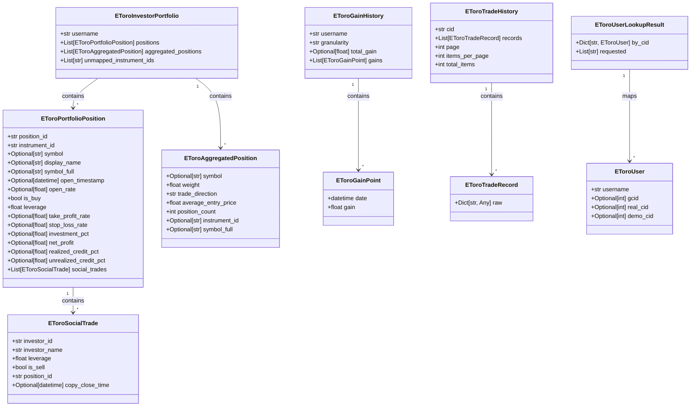
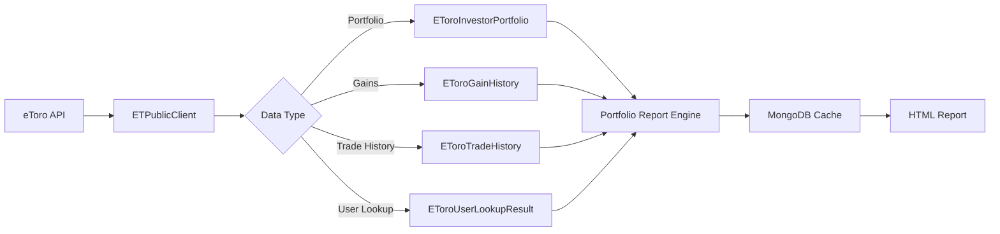

# Portfolio Report Data Models

## Overview

This document describes all data classes used in the portfolio report generation pipeline. These models are defined in `Functions/etoro/models.py` and represent the core data structures flowing through the eToro API client, caching layer, and report engine.

---

## Class Hierarchy

---

## Data Flow

---

## Class Reference

### `EToroInvestorPortfolio`

Represents a complete investor portfolio fetched from the eToro API.

| Field | Type | Description |
|-------|------|-------------|
| `username` | `str` | eToro username |
| `positions` | `List[EToroPortfolioPosition]` | List of open portfolio positions |
| `aggregated_positions` | `List[EToroAggregatedPosition]` | Positions aggregated by symbol and direction |
| `unmapped_instrument_ids` | `List[str]` | Instrument IDs that could not be resolved to tickers |

**Source:** `Functions/etoro/client.py:get_investor_portfolio()`

---

### `EToroPortfolioPosition`

Represents a single open position within a portfolio.

| Field | Type | Description |
|-------|------|-------------|
| `position_id` | `str` | Unique position identifier |
| `instrument_id` | `str` | eToro internal instrument ID |
| `symbol` | `Optional[str]` | Resolved ticker symbol (e.g. `AAPL`) |
| `display_name` | `Optional[str]` | Human-readable display name |
| `symbol_full` | `Optional[str]` | Full symbol string (e.g. `AAPL:US`) |
| `open_timestamp` | `Optional[datetime]` | When the position was opened |
| `open_rate` | `Optional[float]` | Entry price |
| `is_buy` | `bool` | `True` if long, `False` if short |
| `leverage` | `float` | Leverage multiplier (e.g. `1.0`, `2.0`, `5.0`) |
| `take_profit_rate` | `Optional[float]` | Take-profit price level |
| `stop_loss_rate` | `Optional[float]` | Stop-loss price level |
| `investment_pct` | `Optional[float]` | Percentage of portfolio allocated |
| `net_profit` | `Optional[float]` | Current net profit/loss |
| `realized_credit_pct` | `Optional[float]` | Realized credit percentage |
| `unrealized_credit_pct` | `Optional[float]` | Unrealized credit percentage |
| `social_trades` | `List[EToroSocialTrade]` | Copy-trading social trades attached to this position |

**Source:** `Functions/etoro/client.py:get_investor_portfolio()`

---

### `EToroSocialTrade`

Represents a single copy-trading social trade linked to a portfolio position.

| Field | Type | Description |
|-------|------|-------------|
| `investor_id` | `str` | ID of the investor being copied |
| `investor_name` | `str` | Display name of the investor |
| `leverage` | `float` | Leverage used for the copy trade |
| `is_sell` | `bool` | `True` if this was a sell/close copy trade |
| `position_id` | `str` | The position ID this social trade is attached to |
| `copy_close_time` | `Optional[datetime]` | Timestamp when the copy trade was closed |

**Source:** `Functions/etoro/client.py:get_investor_portfolio()`

---

### `EToroAggregatedPosition`

Represents an aggregated view of positions grouped by symbol and trade direction.

| Field | Type | Description |
|-------|------|-------------|
| `symbol` | `Optional[str]` | Ticker symbol (e.g. `AAPL`) |
| `weight` | `float` | Portfolio weight (sum of `abs(investment_pct)`) |
| `trade_direction` | `str` | `"BUY"` or `"SELL"` |
| `average_entry_price` | `float` | Volume-weighted average entry price |
| `position_count` | `int` | Number of positions in this aggregation |
| `instrument_id` | `Optional[str]` | eToro internal instrument ID |
| `symbol_full` | `Optional[str]` | Full symbol string (e.g. `AAPL:US`) |

**Source:** `Functions/etoro/client.py:get_investor_portfolio()`

---

### `EToroGainHistory`

Represents historical gain data for an investor.

| Field | Type | Description |
|-------|------|-------------|
| `username` | `str` | eToro username |
| `granularity` | `str` | Time granularity (`"Daily"` or `"Period"`) |
| `total_gain` | `Optional[float]` | Total gain over the period |
| `gains` | `List[EToroGainPoint]` | Time-series of daily gain points |

**Source:** `Functions/etoro/client.py:get_investor_gain_timeseries()`

---

### `EToroGainPoint`

Represents a single point in the gain time-series.

| Field | Type | Description |
|-------|------|-------------|
| `date` | `datetime` | Date of the gain point |
| `gain` | `float` | Gain value as a decimal fraction (e.g. `0.012` = 1.2%) |

**Source:** `Functions/etoro/client.py:get_investor_gain_timeseries()`

---

### `EToroTradeHistory`

Represents the full trade/credit history for a user, including pagination metadata.

| Field | Type | Description |
|-------|------|-------------|
| `cid` | `str` | Customer ID (numeric string) |
| `records` | `List[EToroTradeRecord]` | List of individual trade records |
| `page` | `int` | Current page number (1-based) |
| `items_per_page` | `int` | Number of items per page |
| `total_items` | `int` | Total number of trade records available |

**Source:** `Functions/etoro/client.py:get_trade_history()`

---

### `EToroTradeRecord`

Wrapper around a single raw trade history JSON entry from the eToro API.

| Field | Type | Description |
|-------|------|-------------|
| `raw` | `Dict[str, Any]` | Raw JSON dictionary containing trade details |

**Typical `raw` keys (from eToro API):**

| Key | Type | Description |
|-----|------|-------------|
| `OpenDate` | `str` | ISO 8601 timestamp when position was opened |
| `Exit Date` | `str` | ISO 8601 timestamp when position was closed |
| `Ticker` | `str` | Ticker symbol (e.g. `AAPL`) |
| `Name` | `str` | Display name of the instrument |
| `Side` | `str` | `"buy"` or `"sell"` |
| `EntryPrice` | `float` | Price at entry |
| `ExitPrice` | `float` | Price at exit |
| `netProfit` | `float` | Net profit/loss from the trade |
| `instrumentId` | `str` | eToro internal instrument ID |
| `leverage` | `float` | Leverage used |
| `VisibleRate` | `float` | Visible rate |
| `Rate` | `float` | Rate |
| `RolloverFees` | `float` | Rollover fees |
| `Dividends` | `float` | Dividends received |
| `Copied` | `bool` | Whether this was a copy trade |
| `ParentPositionId` | `str` | Parent position ID if copied |

**Source:** `Functions/etoro/client.py:get_trade_history()`

---

### `EToroUser`

Represents a resolved eToro user account.

| Field | Type | Description |
|-------|------|-------------|
| `username` | `str` | eToro username |
| `gcid` | `Optional[int]` | Global customer ID |
| `real_cid` | `Optional[int]` | Real-money account customer ID |
| `demo_cid` | `Optional[int]` | Demo account customer ID |

**Source:** `Functions/etoro/client.py:get_users_by_cid()`

---

### `EToroUserLookupResult`

Represents the result of a batch user lookup by CID.

| Field | Type | Description |
|-------|------|-------------|
| `by_cid` | `Dict[str, EToroUser]` | Mapping of CID string to `EToroUser` object |
| `requested` | `List[str]` | List of CID strings that were requested |

**Source:** `Functions/etoro/client.py:get_users_by_cid()`

---

## Usage in Report Generation

These data models are consumed by the portfolio report engine (`Functions/port/engine/`) to produce:

1. **Overview Module** — Uses `EToroInvestorPortfolio`, `EToroAggregatedPosition`, and `EToroGainHistory` for performance summary and allocation charts.
2. **Holdings Module** — Uses `EToroPortfolioPosition` and `EToroAggregatedPosition` for detailed position tables.
3. **History Module** — Uses `EToroTradeHistory` and `EToroTradeRecord` for trade return analysis and win-rate statistics.
4. **Breakdown Module** — Uses `EToroAggregatedPosition` for sector and asset-class breakdowns.
5. **Intel Module** — Uses `EToroUser` and `EToroUserLookupResult` for investor intelligence.

---

## Caching

All data models are cached in MongoDB via `Functions/db/cache.py`:

| Cache Key Pattern | Model | TTL |
|-------------------|-------|-----|
| `("portfolio", username)` | `EToroInvestorPortfolio` | 24 hours |
| `("gains", username, ...)` | `EToroGainHistory` | 24 hours |
| `("history", username, cid, page, per_page)` | `EToroTradeHistory` | 24 hours |
| `("cid", username)` | `EToroUserLookupResult` | 24 hours |

Serialization format: **pickle** (`.pkl`) with **gzip** compression.

---

## Related Files

| File | Role |
|------|------|
| `Functions/etoro/models.py` | Data class definitions |
| `Functions/etoro/client.py` | API client that populates these models |
| `Functions/etoro/auth.py` | Session factory for API authentication |
| `Functions/port/cache.py` | Caching interface |
| `Functions/db/cache.py` | MongoDB cache implementation |
| `Functions/port/engine/analyzer.py` | Portfolio analysis orchestration |
| `Functions/data/loader.py` | Trade history loader |
| `Functions/port/config.py` | Cache TTL constants and configuration |
