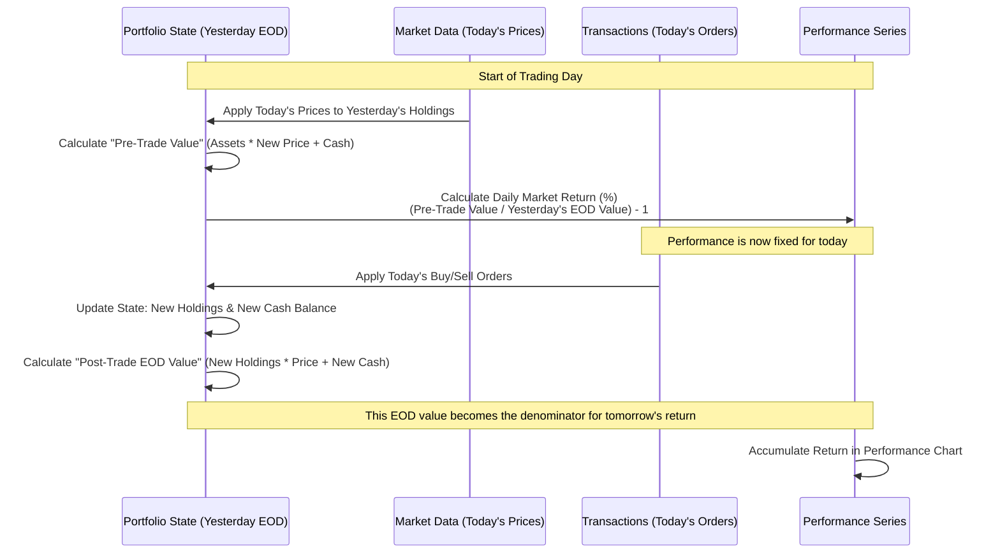

# Portfolio-Management-Utils

## Project Overview

This repository contains a Python-based portfolio functions script developed independently for personal research and testing purposes. It was not developed under any commercial contract or work-for-hire arrangement. All code in this repository was written by Daiviet HUYNH in a personal capacity.


A comprehensive Python-based portfolio functions system for analyzing and visualizing investment portfolios. The system loads portfolio data from Excel holdings or CSV transaction ledgers, calculates detailed performance and risk metrics, and generates a professional interactive HTML report with Plotly visualizations.

It supports **one execution path**:
1. **CSV Transactions** – Historical backtesting with full transaction history, cash flows, and fees

## Data Provider Architecture

Market data is abstracted behind a provider interface (`engine/data/protocols.py`) to support pluggable data sources. The default provider is **Yahoo Finance** (`engine/data/yfinance_provider.py`), selected via the `DATA_PROVIDER` config key (`engine/config.py:23`) or the `MARKET_DATA_PROVIDER` environment variable. The facade `engine/data/market.py` preserves existing function signatures while delegating to the chosen provider.

See [DATA_ARCHITECTURE.md#market-data-provider-layer](DATA_ARCHITECTURE.md) for details.

## Getting Started

To set up and run this project, follow these steps:

### Prerequisites

Ensure you have Python 3.x installed. The project dependencies are listed in [`requirements.txt`](requirements.txt).

### Installation

1.  **Clone the repository:**
    ```bash
    git clone <repository_url>
    cd Portfolio-Management-Utils
    ```
2.  **Create a virtual environment (recommended):**
    ```bash
    python -m venv venv
    source venv/bin/activate  # On Windows, use `venv\Scripts\activate`
    ```
3.  **Install the required libraries:**
    ```bash
    pip install -r requirements.txt
    ```

**For Windows users:** Double-click `run_portfolio_analysis.bat` to automatically install dependencies and run the analysis. The batch file handles environment setup and launches the interactive CLI.

### Usage

The script supports one primary input method for your portfolio:

#### Method 1: Dynamic Transaction Ledger (CSV)
You can import your full trade history via `transactions.csv`. This enables true backtesting that accounts for cash additions/withdrawals, transaction fees, and position evolution over time using FIFO accounting.

Example `transactions.csv`:
| Date | Ticker | Side | Quantity | Price | Fees | Currency |
|------|--------|------|----------|-------|------|----------|
| 01/01/2023 | BHP.AX | BUY | 100 | 45.00 | 10.00 | AUD |
| 15/06/2023 | BHP.AX | SELL | 50 | 48.50 | 10.00 | AUD |

**Running the Analysis:**

**On macOS/Linux:**
```bash
python main.py
```

Use the CLI flag `--no-browser` to suppress automatic browser opening:
```bash
python main.py --no-browser
```

**On Windows:**
- Either run `run_portfolio_analysis.bat` (double-click in Explorer or run from Command Prompt)
- Or use Command Prompt/PowerShell: `python main.py`

Once started, follow the interactive prompts:

- Enter the benchmark ticker.
- Configure portfolio optimization parameters: maximum position size per asset, and maximum sector size per sector. The lookback period for optimization analysis is fixed at 1 year.

After your choices are submitted, the script will:
1. Download market data from Yahoo Finance
2. Construct the portfolio time series
3. Calculate all performance and risk metrics
4. Generate interactive Plotly charts
5. Build `portfolio_report.html` and open it in your browser

## Project Structure

The project is organized as a Python package with the following structure:

```
engine/                        # Main modeling package
├── __init__.py                   # Package exports
├── analyzer.py                   # PortfolioAnalyzer – main orchestration class
├── config.py                     # Global configuration defaults
├── data/                         # Data loading & market data (provider layer)
│   ├── __init__.py
│   ├── loader.py                 # Portfolio & transaction loading from files
│   ├── market.py                 # Facade; delegates to provider layer
│   ├── models.py                 # AssetMetadata dataclass
│   ├── protocols.py              # MarketDataProvider ABC
│   ├── provider_factory.py       # Factory selecting Yahoo Finance / other providers
│   └── yfinance_provider.py      # Yahoo Finance implementation
├── modeling/                     # Core modeling modules
│   ├── __init__.py
│   ├── timeseries.py             # Portfolio time series construction, returns calculation
│   ├── metrics.py                # Performance metrics (Sharpe, Alpha, etc.)
│   └── risk.py                   # VaR, CVaR, Monte Carlo, shock analysis, risk decomposition
├── output/                    # Visualization & output
│   ├── __init__.py
│   ├── charts.py                 # Base chart dispatcher (performance, correlation, risk strip)
│   ├── html.py                   # Full HTML report assembly
│   └── templates/
│       └── base.html             # Master HTML template with all tab panels
└── modules/                       # Modular tab system (one sub-package per tab)
    ├── __init__.py
    ├── overview/                 # Overview tab: performance charts, metrics strip, A/D
    │   ├── __init__.py
    │   ├── charts.py             # Performance barchart, main performance chart, A/D charts
    │   ├── commentary.py         # Overview insights
    │   ├── renderer.py           # render_overview_tab()
    │   └── template.html
    ├── correlation/              # Correlation tab: heatmap, rolling, regime, stability
    │   ├── __init__.py
    │   ├── charts.py             # Full heatmap, correlation panel, stability score, regime indicator
    │   ├── commentary.py         # Correlation insights
    │   ├── renderer.py           # render_correlation_tab()
    │   └── template.html
    ├── risks/                    # Risks tab: VaR/ES analysis, risk metrics strip
    │   ├── __init__.py
    │   ├── charts.py             # generate_var_es_analysis_charts()
    │   ├── commentary.py         # Risk insights
    │   ├── renderer.py           # render_risks_tab()
    │   └── template.html
    ├── monte_carlo/              # Monte Carlo tab: fan chart, distribution, metrics strip
    │   ├── __init__.py
    │   ├── charts.py             # GBM fan chart, metrics strip
    │   ├── commentary.py         # Monte Carlo insights
    │   ├── renderer.py           # render_monte_carlo_tab()
    │   └── template.html
    ├── holdings/                 # Holdings tab: per-ticker table, mini-charts, Z-score negation
    │   ├── __init__.py
    │   ├── charts.py             # Holdings metrics strip
    │   ├── commentary.py         # Holdings insights & commentary
    │   ├── renderer.py           # generate_portfolio_holdings_analysis(), generate_negative_zscore_table()
    │   └── template.html
├── history/                   # History tab: blotter table, trade statistics, metrics strip
     │   ├── __init__.py
     │   ├── charts.py             # Trades metrics strip, scatter plots
     │   ├── commentary.py         # Trades insights
     │   ├── renderer.py           # generate_trades_table()
     │   └── template.html
    ├── breakdown/                # Breakdown tab: sector sunburst, sector performance table, Z-score scatter
    │   ├── __init__.py
    │   ├── charts.py             # Sector sunburst, Z-score scatter, sector/industry performance table
    │   ├── commentary.py         # Breakdown insights
    │   ├── renderer.py           # generate_sector_industry_analysis(), generate_sector_performance_table()
    │   └── template.html
    ├── efficiency/               # Efficiency tab: trend analysis, momentum markers, extreme markers
    │   ├── __init__.py
    │   ├── charts.py             # Efficiency trend line, momentum/extreme markers
    │   ├── commentary.py         # Efficiency insights
    │   ├── renderer.py           # render_efficiency_tab()
    │   └── template.html
    └── optimisation/             # Optimisation tab: SLSQP-based weight optimizer
        ├── __init__.py
        ├── optimizer.py          # optimize_portfolio() – 5 SLSQP objectives (sector-bound scaling)
        ├── renderer.py           # render_optimisation_tab()
        └── template.html

main.py                           # Root entry point script (interactive CLI)
config.py                        # Legacy global config and custom exceptions
requirements.txt                 # Python dependencies
transactions.csv                 # (Input) CSV file for trade history import
portfolio_report.html            # (Output) The interactive analytics report
```

### Package API

You can import functions directly from the `engine` package:

```python
from engine import (
    load_portfolio,
    load_transactions_from_csv,
    download_price_data,
    build_portfolio_timeseries,
    calculate_performance_metrics,
    calculate_risk_contribution,
    run_monte_carlo_simulation,
    generate_html_report,
    # ... and more
)
```

## Key Features

- **Transaction-Based Backtesting:** Import full trade history to analyze performance while correctly handling cash flows, fees, and evolving positions (FIFO).
-   **Advanced Risk Metrics:** Value at Risk (VaR), Conditional VaR (CVaR/Expected Shortfall), Jensen's Alpha, Information Ratio, max drawdowns at multiple horizons (1M, 1Y, 5Y).
-   **Statistical Analysis:** 1-Year Z-Score tracking to identify assets trading significantly above or below their historical mean; negative-Z-score attention table.
-   **Momentum & Reversal Signals:** Automated identification of long-term trends (Momentum Spread vs SMA200) and short-term exhaustion (14-day RSI Overbought/Oversold).
-   **Tail Risk Stress Testing:** "Shock Curve" analysis simulating portfolio behavior under severe market downturns (−20%, −30%, −50%) with individual asset contribution tables.
-   **Monte Carlo Simulation:** Forecasts 10,000 potential future paths for the portfolio over a 1-year horizon using Geometric Brownian Motion (GBM).
-   **Sector & Industry Exposure:** Deep-dive breakdown of weighting and concentration across market sectors and industries, including sector sunburst and performance tables.
- **Portfolio Optimisation (SLSQP):** Finds optimal weights across five objectives – Max Sharpe, Max Sortino, Max Information Ratio, Min Max-Drawdown, and Best Match (combined) – with sector-limit bounds. Sector limits use a sector-sum feasibility factor (actual code: `scale_factor = 1.20 / max(1e-8, sector_sum)`, `optimizer.py:153`): when the sum of relaxed sector bounds falls below the feasibility floor of 1.20, they are uniformly scaled up so the SLSQP solver retains full degrees of freedom.
-   **Modular Tab System:** Each analysis tab (Overview, Correlation, Risks, Monte Carlo, Holdings, History, Breakdown, Efficiency, Optimisation) is a self-contained sub-package with its own charts, commentary, renderer, and template, making it easy to add or modify individual views.
-   **Dynamic Charting:** Interactive, reproducible Plotly charts for all tabs, with colours driven centrally by `engine/config.py`.
-   **Automated Commentary:** AI-generated insights and risk explanations embedded in each report tab.
-   **Efficiency Analysis:** New Efficiency tab with trend-line, momentum markers, and extreme-value overlays to surface portfolio execution quality.

## Data Architecture

The system's data pipeline is organized into three logical layers:

1. **Input Layer:** Excel holdings (`core_portfolio.xlsx`, `active_portfolio.xlsx`) or CSV transactions (`transactions.csv`) + Yahoo Finance market data.
2. **Construction Layer:** Portfolio time series (`ts` dict) and returns series (`returns` dict) built via `build_portfolio_timeseries()`.
3. **Analysis Layer:** Risk contribution (`risk_df`), Monte Carlo simulations, and enriched holdings data (`holdings_df`).

See [DATA_ARCHITECTURE.md](DATA_ARCHITECTURE.md) for a complete visual flow diagram, dataset descriptions, and input method branching logic.

## Dividend Yield
## Advanced Methodology: Rebalance & Gap Neutralization

This project uses a specialized mechanism to prevent large gaps or artificial spikes in portfolio performance during major rebalances or transaction gaps.

### The Problem
When a portfolio undergoes a massive rebalance or cash injection, a simple calculation of total value change is misleading. If you add $100k to a $100k portfolio, your value doubles, but your *performance* hasn't changed.

### The Solution: Market-Only Performance Tracking
The script uses a two-phase calculation for each trading day to isolate true market performance:

1.  **Market Performance Phase:** Calculates return based on assets held *before* today's trades using today's prices.
2.  **State Transformation Phase:** Applies today's transactions (buys/sells) to update the portfolio state for the *next* day.

This ensures that only price movements drive the performance chart, while transactions are treated as "state changes" that do not artificially inflate or deflate returns.

---

### Workflow Diagram



## Global Defaults

Default portfolio functions settings are defined centrally in `engine/config.py`:

| Setting | Default |
|---|---|
| Initial capital | $100,000 |
| Sharpe target | 1.0 |
| Sortino target | 1.5 |
| Information Ratio target | 0.5 |
| Maximum position size per asset | 5% |
| Maximum sector size per sector | 30% |
| Default benchmark ticker | `^AXJO` |
