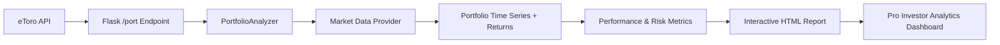

# Portfolio & Risk Analytics

## Project Overview

Portfolio analytics module for interpreting eToro portfolio data and delivering advanced analytics for Pro Investors. The module is served via the AlphaSentra Flask backend under the `/port` endpoint. It fetches live portfolio data from the eToro API, enriches it with market data, computes comprehensive performance and risk metrics, and renders an interactive Plotly HTML report.

**Input:** eToro API (live portfolio data)



## Data Provider Architecture

Market data is abstracted behind a provider interface (`data/protocols.py`) to support pluggable data sources. The default provider is **Yahoo Finance** (`data/yfinance_provider.py`), selected via the `DATA_PROVIDER` config key (`config.py:20`) or the `MARKET_DATA_PROVIDER` environment variable. The facade `data/market.py` preserves existing function signatures while delegating to the chosen provider.

See [data/DATA_PROVIDER.md](data/DATA_PROVIDER.md) for details.

## Prerequisites

Ensure you have Python 3.x installed. The project dependencies are listed in [`../../requirements.txt`](../../requirements.txt).

## Usage

The module fetches live portfolio data from the eToro API using the configured username.

1. Configure your eToro username in the environment or config.
2. Start the Flask backend: `python app.py` (from the project root).
3. Navigate to `http://localhost:8888/port`.

## Project Structure

The module is organized as a Python package:

```
Functions/port/
├── main.py                          # Portfolio entry point (HTML + commentary generators)
├── config.py                        # Global config, theme color mapping
├── README.md                        # This file
├── engine/
│   ├── __init__.py
│   ├── analyzer.py                  # PortfolioAnalyzer – main orchestration class
│   ├── modeling/
│   │   ├── __init__.py
│   │   ├── timeseries.py            # Portfolio time series + returns calculation
│   │   ├── metrics.py               # Sharpe, Alpha, VaR, etc.
│   │   └── risk.py                  # VaR, CVaR, Monte Carlo, shock analysis
│   ├── output/
│   │   ├── __init__.py
│   │   ├── charts.py                # Base chart dispatcher
│   │   └── html.py                  # Full HTML report assembly
│   └── modules/
│       ├── __init__.py
│       ├── overview/                # Performance charts, metrics strip, A/D
│       ├── correlation/             # Heatmap, rolling, regime, stability
│       ├── risks/                   # VaR/ES analysis, risk metrics strip
│       ├── monte_carlo/             # GBM fan chart, distribution
│       ├── holdings/                # Per-ticker table, mini-charts, Z-score negation
│       ├── history/                 # Blotter table, trade statistics
│       ├── breakdown/               # Sector sunburst, sector performance table
│       ├── efficiency/              # Trend line, momentum markers, extreme markers
│       └── optimisation/            # SLSQP-based weight optimizer
```

## Key Features

- **eToro Portfolio Import:** Consumes transaction history exported from eToro and handles FIFO accounting.
- **Advanced Risk Metrics:** Value at Risk (VaR), Conditional VaR (CVaR/Expected Shortfall), Jensen's Alpha, Information Ratio, max drawdowns at multiple horizons.
- **Statistical Analysis:** 1-Year Z-Score tracking; negative-Z-score attention table.
- **Momentum & Reversal Signals:** Momentum Spread vs SMA200, 14-day RSI Overbought/Oversold.
- **Tail Risk Stress Testing:** Shock Curve analysis simulating severe market downturns.
- **Monte Carlo Simulation:** 10,000 GBM paths over a 1-year horizon.
- **Sector & Industry Exposure:** Sector sunburst, performance tables, weighting breakdown.
- **Portfolio Optimisation (SLSQP):** Max Sharpe, Max Sortino, Max Information Ratio, Min Max-Drawdown, and Best Match with sector-limit bounds.
- **Modular Tab System:** Self-contained sub-packages for Overview, Correlation, Risks, Monte Carlo, Holdings, History, Breakdown, Efficiency, and Optimisation.
- **Dynamic Charting:** Interactive Plotly charts with centralized theme colours.
- **Automated Commentary:** AI-generated insights embedded in each report tab.

## Advanced Methodology: Rebalance & Gap Neutralization

A two-phase calculation isolates true market performance from transaction state changes:

1. **Market Performance Phase:** Return is calculated based on assets held before today's trades using today's prices.
2. **State Transformation Phase:** Today's transactions are applied to update the portfolio state for the next day.

This prevents artificial spikes or gaps in the performance chart during rebalances or cash injections.

## Global Defaults

Default portfolio settings are defined centrally in `config.py`:

| Setting | Default |
|---|---|
| Initial capital | $10,000 |
| Sharpe target | 1.0 |
| Sortino target | 1.5 |
| Information Ratio target | 0.5 |
| Maximum position size per asset | 20% |
| Maximum sector size per sector | 30% |
| Default benchmark ticker | Dynamically selected from `BENCHMARK_CANDIDATES` (`^AXJO`, `^GSPC`, `^STOXX50E`, `BTC-USD`, `^990100-USD-STRD`) |
