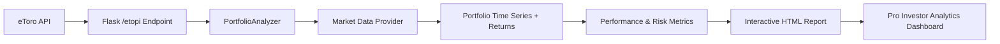

# Portfolio & Risk Analytics

## Project Overview

Portfolio analytics module for interpreting eToro portfolio data and delivering advanced analytics for Pro Investors. The module is served via the AlphaSentra Flask backend under the `/etopi` endpoint. It fetches live portfolio data from the eToro API, enriches it with market data, computes comprehensive performance and risk metrics, and renders an interactive Plotly HTML report.

**Authentication:** The `/etopi` and `/port` endpoints require the `etoro_authuser` cookie. However, if the requested page is already cached, the cached HTML is served without authentication. See [AUTH.md](../AUTH.md) for details.

**Input:** eToro API (live portfolio data)



## Data Provider Architecture

Market data is abstracted behind a provider interface (`../data/protocols.py`) to support pluggable data sources. The default provider is **Yahoo Finance** (`../data/yfinance_provider.py`), selected via the `DATA_PROVIDER` config key (`config.py:42`) or the `MARKET_DATA_PROVIDER` environment variable. The facade `../data/market.py` preserves existing function signatures while delegating to the chosen provider.

See [../data/DATA_PROVIDER.md](../data/DATA_PROVIDER.md) for details.

## Prerequisites

Ensure you have Python 3.x installed. The project dependencies are listed in [`../../requirements.txt`](../../requirements.txt).

## Usage

The module fetches live portfolio data from the eToro API using the configured username.

1. Configure your eToro username in the environment or config.
2. Start the Flask backend: `python app.py` (from the project root).
3. Navigate to `http://localhost:8888/etopi`.

## Project Structure

The module is organized as a Python package:

```
Functions/port/
├── main.py                          # Portfolio entry point (HTML + commentary generators)
├── config.py                        # Global config, theme color mapping
├── README.md                        # This file
├── engine/
│   ├── __init__.py
│   ├── analyzer.py                  # PortfolioAnalyzer – main orchestration class
│   ├── modeling/
│   │   ├── __init__.py
│   │   ├── timeseries.py            # Portfolio time series + returns calculation
│   │   ├── metrics.py               # Sharpe, Alpha, VaR, etc.
│   │   └── risk.py                  # VaR, CVaR, Monte Carlo, shock analysis
│   ├── output/
│   │   ├── __init__.py
│   │   ├── charts.py                # Base chart dispatcher
│   │   └── html.py                  # Full HTML report assembly
│   └── modules/
│       ├── __init__.py
│       ├── overview/                # Performance charts, metrics strip, A/D
│       ├── correlation/             # Heatmap, rolling, regime, stability
│       ├── risks/                   # VaR/ES analysis, risk metrics strip
│       ├── monte_carlo/             # GBM fan chart, distribution
│       ├── holdings/                # Per-ticker table, mini-charts, Z-score negation
│       ├── history/                 # Blotter table, trade statistics
│       ├── breakdown/               # Sector sunburst, sector performance table
│       ├── efficiency/              # Trend line, momentum markers, extreme markers
│       └── optimisation/            # SLSQP-based weight optimizer
```

## Key Features

- **eToro Portfolio Import:** Fetches live portfolio data and trade history from the eToro API and handles FIFO accounting for the Trades tab.
- **Advanced Risk Metrics:** Value at Risk (VaR), Conditional VaR (CVaR/Expected Shortfall), Jensen's Alpha, Information Ratio, max drawdowns at multiple horizons.
- **Statistical Analysis:** 1-Year Z-Score tracking; negative-Z-score attention table.
- **Momentum & Reversal Signals:** Momentum Spread vs SMA200, 14-day RSI Overbought/Oversold.
- **Tail Risk Stress Testing:** Shock Curve analysis simulating severe market downturns.
- **Monte Carlo Simulation:** 10,000 GBM paths over a 1-year horizon.
- **Sector & Industry Exposure:** Sector sunburst, performance tables, weighting breakdown.
- **Portfolio Optimisation (SLSQP):** Max Sharpe, Max Sortino, Max Information Ratio, Min Max-Drawdown, and Best Match with sector-limit bounds.
- **Modular Tab System:** Self-contained sub-packages for Overview, Correlation, Risks, Monte Carlo, Holdings, History, Breakdown, Efficiency, and Optimisation.
- **Dynamic Charting:** Interactive Plotly charts with centralized theme colours.
- **Automated Commentary:** AI-generated insights embedded in each report tab.
- **Pro Investor Selection (`/port`):** Renders a searchable Top Pro Investor table with flag + ISO alpha-2 country badges. Country data is resolved at runtime using the [countries.dev](https://countries.dev) API, with eToro internal `countryId` values translated to ISO codes via `Functions/etoro/countries.csv`.
- **Unmapped Instruments Tracking:** Instruments that cannot be resolved to canonical tickers are recorded in the `etoro_unmapped_instruments` collection in the logs MongoDB database (`MONGODB_URI_LOGS` / `MONGODB_DATABASE_LOGS`). This enables monitoring and deduplication of resolution failures.
- **Stale Cache Refusal:** If a stale cached portfolio contains unmapped instruments, the system refuses to serve it and forces a fresh API fetch instead. This prevents serving incomplete portfolio snapshots.
- **DB Fallback for Instrument Resolution:** When the eToro search API fails to resolve an instrument, the system falls back to the `etoro_instruments` MongoDB collection (`Functions/db/repositories.py:lookup_etoro_instruments_from_db`).

## Pro Investor Selection — Country Resolution

The `/port` endpoint (`Functions/port/selection.py`) renders the Pro Investor selection table. Country display is resolved in three steps:

### 1. eToro Internal ID → ISO Mapping

The eToro API returns a `countryId` field that is eToro's own internal numeric identifier (e.g. `12`). This is **not** an ISO 3166-1 numeric code. The module loads `Functions/etoro/countries.csv` at startup to build a lookup:

```
ETORO_COUNTRYID,ISO_COUNTRYID,ISO_CODE
1,004,AF
12,036,AU
36,???,(not in CSV — falls back to API)
...
```

When rendering a row, if the `country` field is missing but `countryId` is present, the CSV map is consulted first:
- `countryId=12` → ISO `AU` (Australia)
- `countryId=36` → no CSV entry → falls back to raw value

### 2. Country Info Lookup via countries.dev

The resolved ISO alpha-2 code (e.g. `AU`) is passed to the [countries.dev](https://countries.dev) API:

```
GET https://countries.dev/alpha/{code}?fields=name,alpha2Code,flag
```

Response fields used:
- `flag` — Unicode flag emoji (e.g. `🇦🇺`)
- `alpha2Code` — ISO alpha-2 code (e.g. `AU`)

Results are cached in `_COUNTRY_INFO_CACHE` for the lifetime of the module.

### 3. Prefetch for Performance

Before rendering rows, `_prefetch_country_data()` extracts all unique country values from the investor list and resolves them concurrently using `ThreadPoolExecutor(max_workers=8)`. This avoids sequential API calls during HTML generation.

### Fallback Behaviour

| Scenario | Result |
|----------|--------|
| `country` field present (ISO alpha-2) | Used directly, API returns flag + code |
| `country` missing, `countryId` mapped in CSV | ISO code from CSV, then API lookup |
| `country` missing, `countryId` not in CSV | Raw `countryId` string displayed without flag |
| API request fails | Raw code displayed without flag |

### CSV Reference

The mapping file is located at `Functions/etoro/countries.csv`. It contains 105 rows covering all eToro-supported countries. Each row has:

| Column | Description |
|--------|-------------|
| `ETORO_COUNTRYID` | eToro's internal numeric country identifier |
| `ISO_COUNTRYID` | ISO 3166-1 numeric code (3 digits, zero-padded) |
| `ISO_CODE` | ISO 3166-1 alpha-2 code (2 letters) |

The module reads only `ETORO_COUNTRYID` and `ISO_CODE` for the lookup; `ISO_COUNTRYID` is retained in the CSV for reference but is not used by `selection.py`.

## Unmapped Instruments & Logs

When the eToro portfolio API returns positions with instrument IDs that cannot be resolved to canonical tickers, the system records these in the `etoro_unmapped_instruments` collection in the logs MongoDB database.

### Recording Unmapped Instruments

`Functions/etoro/client.py:_record_unmapped_instruments()` writes a document for each unresolved instrument containing:

| Field | Description |
|-------|-------------|
| `username` | eToro username |
| `instrument_id` | Unresolved eToro instrument ID |
| `symbol_full` | Any symbol available from the eToro symbol map |
| `raw_symbol` | Raw symbol from the API response |
| `display_name` | Display name from the API response |
| `open_rate` | Open rate from the API response |
| `investment_pct` | Investment percentage from the API response |
| `position_id` | Position ID from the API response |
| `is_buy` | Trade direction from the API response |
| `leverage` | Leverage from the API response |
| `detected_at` | UTC timestamp when the instrument was detected as unmapped |

### Stale Cache Refusal

If a cached portfolio report contains unmapped instruments, the system refuses to serve the stale cache and forces a fresh API fetch. This prevents serving incomplete portfolio snapshots to users.

```python
# Functions/etoro/client.py:get_investor_portfolio()
if stale is not None:
    if getattr(stale, 'unmapped_instrument_ids', []):
        logger.warning(
            "Stale cache for %s has %d unmapped instruments; refusing to serve incomplete portfolio",
            username, len(stale.unmapped_instrument_ids),
        )
    else:
        logger.warning("Live portfolio API failed for %s; using stale cache", username)
        return stale
```

### Deduplication

Run `Functions/batch/logs_rm_duplicated.py` to deduplicate the `etoro_unmapped_instruments` collection. The script retains the most recent document per `(username, instrument_id)` group and deletes all others.

### Required Environment Variables

| Variable | Default | Description |
|----------|---------|-------------|
| `MONGODB_URI_LOGS` | — | **Required.** MongoDB connection URI for the logs database. |
| `MONGODB_DATABASE_LOGS` | `alphasentra-logs` | Logs database name. |

## Advanced Methodology: Rebalance & Gap Neutralization

A two-phase calculation isolates true market performance from transaction state changes:

1. **Market Performance Phase:** Return is calculated based on assets held before today's trades using today's prices.
2. **State Transformation Phase:** Today's transactions are applied to update the portfolio state for the next day.

This prevents artificial spikes or gaps in the performance chart during rebalances or cash injections.

## Global Defaults

Default portfolio settings are defined centrally in `config.py`:

| Setting | Default |
|---|---|
| Initial capital | $10,000 |
| Maximum position size per asset | 30% |
| Maximum short size per asset | 30% |
| Minimum position size per asset | 0.50% |
| Long/short optimization | Disabled |
| Gross exposure limit | 2.0x |
| Cache TTL (report) | 24 hours |
| Cache TTL (price) | 24 hours |
| Cache TTL (sector/industry) | 24 hours |
| Cache TTL (eToro) | 24 hours |
| Cache TTL (eToro PI) | 24 hours |
| Default market data provider | `yfinance` |
| Default benchmark candidates | `^AXJO`, `^GSPC`, `^STOXX50E`, `^FTSE`, `BTC-USD`, `^990100-USD-STRD` |

Benchmark selection is automatic: the first candidate present in the downloaded price data is used, with preference ordered by the portfolio's inferred primary market (`AU` → `^AXJO`, `US` → `^GSPC`, `EU` → `^STOXX50E`, `UK` → `^FTSE`, `CRYPTO` → `BTC-USD`).
